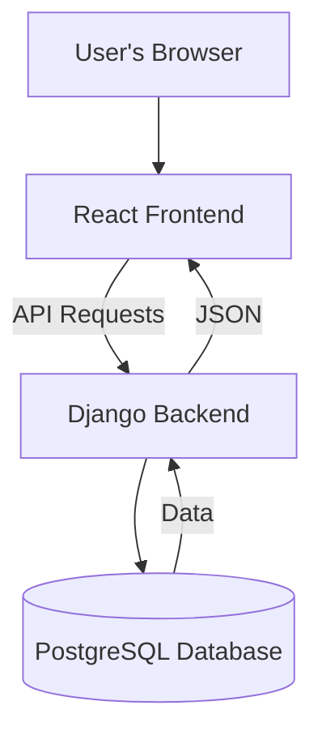
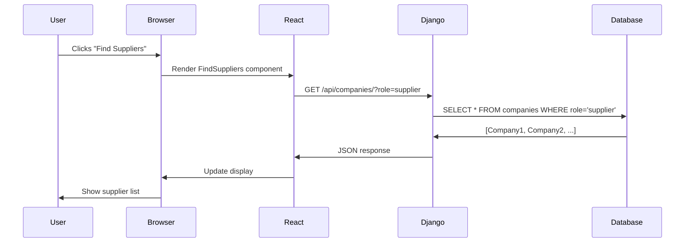
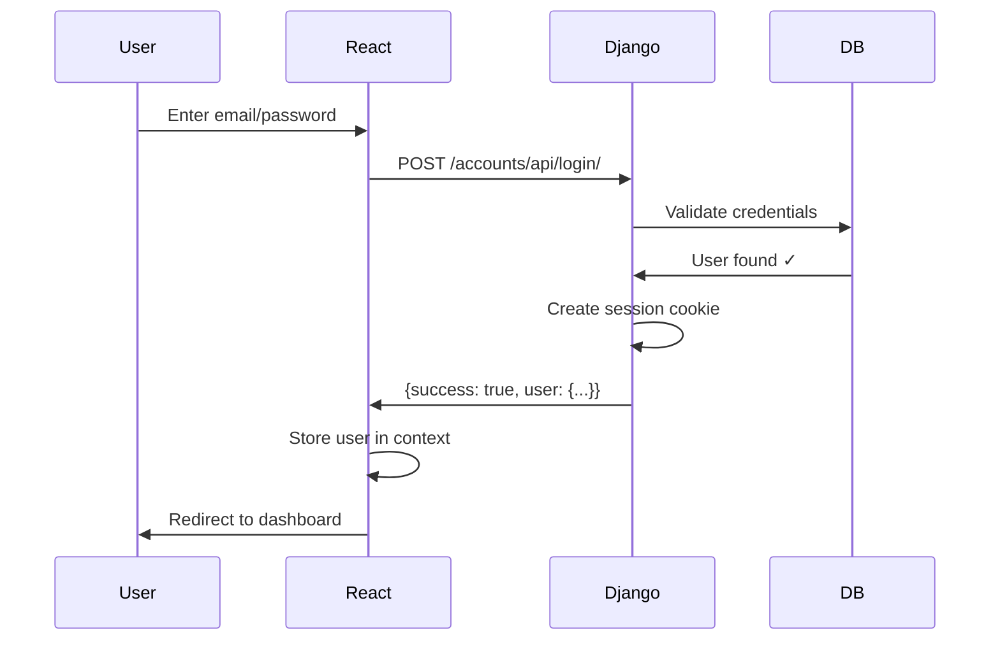
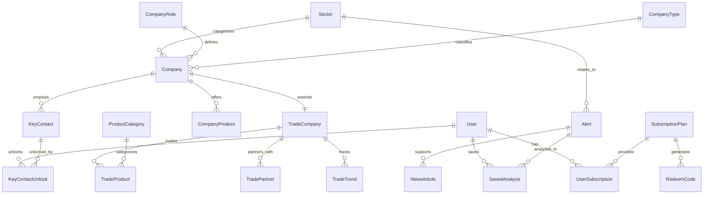
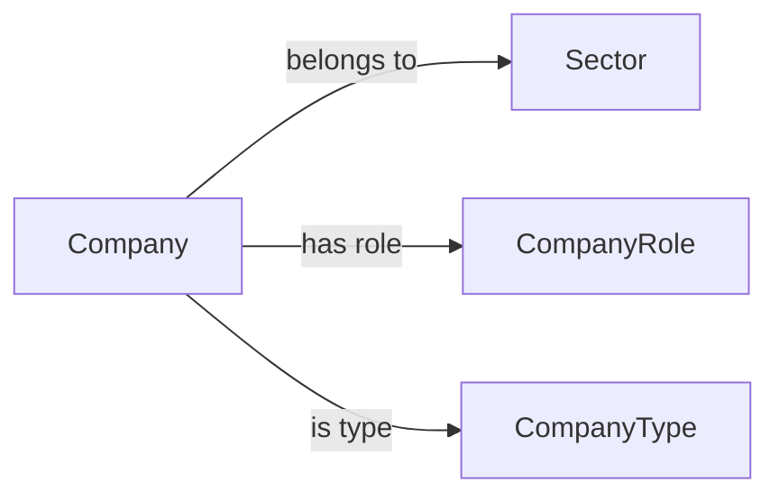
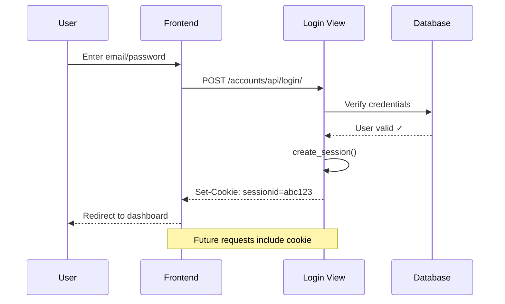
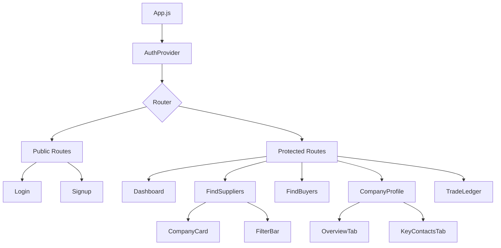
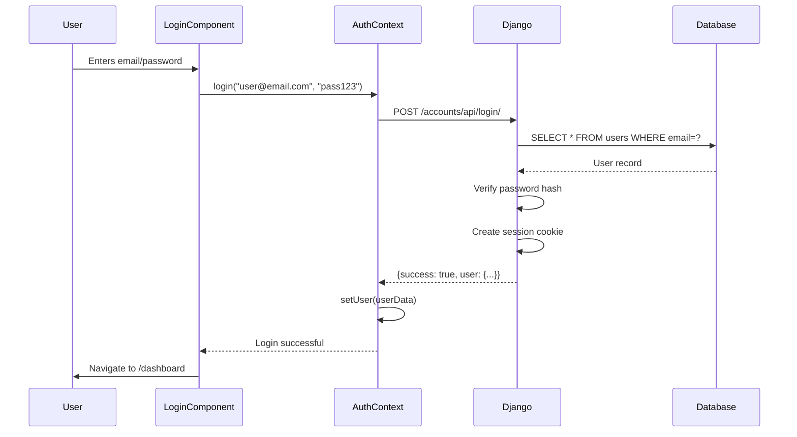
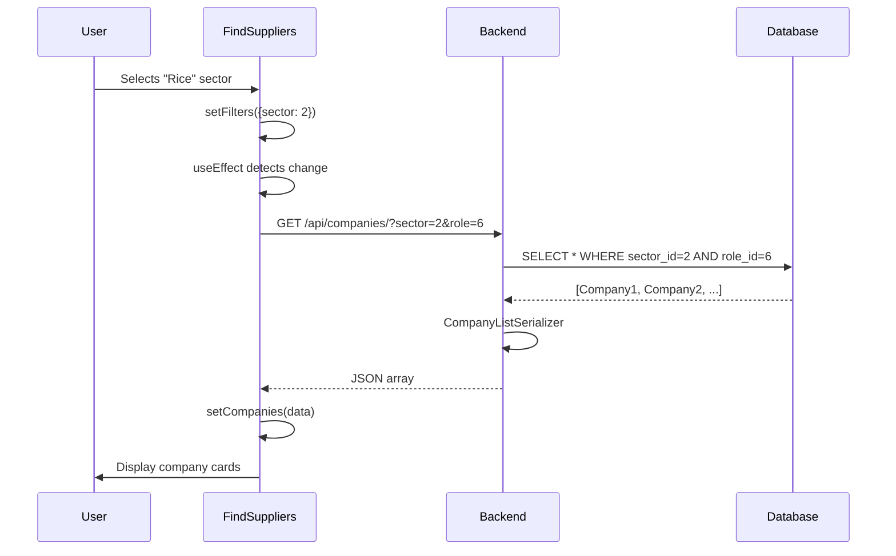
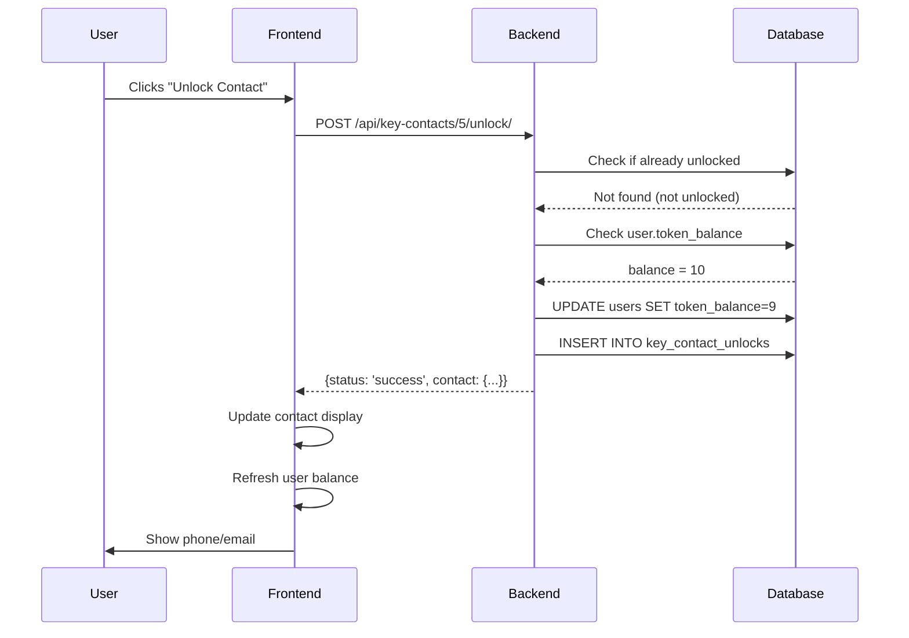

# ZaraiLink: Complete Deep Dive Walkthrough

> **For Absolute Beginners** - Assumes zero prior knowledge of Django, React, APIs, or databases

---

## 📋 Table of Contents

1. [Part 1: Introduction & Overview](#part-1-introduction--overview)
2. [Part 2: Database Schema](#part-2-database-schema)
3. [Part 3: Backend Architecture](#part-3-backend-architecture)
4. [Part 4: Frontend Architecture](#part-4-frontend-architecture)
5. [Part 5: Data Flows & Key Features](#part-5-data-flows--key-features)
6. [Glossary](#glossary)

---

# Part 1: Introduction & Overview

See [part1_introduction.md](file:///C:/Users/hunai/.gemini/antigravity/brain/d1c6917b-ea91-492e-abd0-afe085646a0a/part1_introduction.md) for complete introduction including:
- What is ZaraiLink?
- Technology stack explained
- Project structure
- How the application works
- Key concepts (databases, components, state)
- Authentication flow overview

**Quick Summary:** ZaraiLink is an agricultural trade intelligence platform built with React (frontend) and Django (backend), using PostgreSQL database. It helps businesses find trading partners, access trade data, get market intelligence, and unlock verified contacts using a token system.

---

# Part 2: Database Schema

See [part2_database.md](file:///C:/Users/hunai/.gemini/antigravity/brain/d1c6917b-ea91-492e-abd0-afe085646a0a/part2_database.md) for complete database documentation including:
- Entity Relationship Diagrams
- All 30+ models explained
- Accounts App (User, UserAlertPreference)
- Companies App (Company, Sector, CompanyProduct, KeyContact, KeyContactUnlock)
- Trade Ledger App (TradeCompany, TradeProduct, TradePartner, TradeTrend)
- Subscriptions App (SubscriptionPlan, RedeemCode, UserSubscription)
- Market Intelligence App (Alert, NewsArticle, SavedAnalysis)
- Relationship types (One-to-Many, One-to-One, Many-to-Many)

**Key Models:**
- **User** - Custom auth with email and token balance
- **Company** - Core company profile
- **KeyContact** - Private contacts (locked by default)
- **TradeCompany** - Extended trade statistics
- **SubscriptionPlan** - Token packages

---

# Part 3: Backend Architecture

See [part3_backend.md](file:///C:/Users/hunai/.gemini/antigravity/brain/d1c6917b-ea91-492e-abd0-afe085646a0a/part3_backend.md) for complete backend documentation including:
- Django project structure
- Two-level URL routing system
- ViewSets and API endpoints
- Serializers for JSON conversion
- Session-based authentication
- Email verification flow
- Custom actions (contact unlocking)
- Statistics endpoints
- Common patterns and best practices

**Key Concepts:**
- **ViewSet** - Handles CRUD operations
- **Serializer** - Converts models ↔ JSON
- **Routing** - Project URLs → App URLs → ViewSets
- **Session Auth** - Cookie-based authentication

---

# Part 4: Frontend Architecture

See [part4_frontend.md](file:///C:/Users/hunai/.gemini/antigravity/brain/d1c6917b-ea91-492e-abd0-afe085646a0a/part4_frontend.md) for complete frontend documentation including:
- React basics and components
- Component hierarchy
- React Router for navigation
- State management with hooks (useState, useEffect)
- Context API for global state (AuthContext)
- API integration patterns
- Protected routes
- CSS organization
- Complete component examples

**Key Concepts:**
- **Component** - Reusable UI piece
- **State** - Data React remembers
- **Context** - Global state (auth, user)
- **useEffect** - Handle side effects (API calls)
- **useParams** - Get URL parameters

---

# Part 5: Data Flows & Key Features

See [part5_dataflows.md](file:///C:/Users/hunai/.gemini/antigravity/brain/d1c6917b-ea91-492e-abd0-afe085646a0a/part5_dataflows.md) for complete data flow documentation including:
- User login journey (complete sequence)
- Finding suppliers with filters
- Unlocking contacts with tokens
- Email verification system
- Token economy mechanics
- Dynamic data visualization
- Common patterns and best practices
- Complete glossary

**Key Flows:**
1. **Login** - User → React → Django → Database → Session
2. **Search** - Filter → API Request → Database Query → JSON → Display
3. **Unlock** - Check balance → Deduct token → Create record → Show contact

---

## Glossary

| Term | Simple Definition |
|------|-------------------|
| **API** | Way for programs to talk (like a waiter) |
| **Component** | Reusable UI piece (like LEGO block) |
| **Context** | Global state in React |
| **Django** | Python web framework |
| **ForeignKey** | Link to another database table |
| **Hook** | Special React function (useState, useEffect) |
| **JSON** | Data format for APIs |
| **Model** | Database table in Django |
| **Serializer** | Converts models ↔ JSON |
| **Session** | Server remembers you're logged in |
| **State** | Data React remembers |
| **Token** | Auth credential OR app currency |
| **ViewSet** | Django class for CRUD operations |

---

## Project Statistics

- **Backend Framework:** Django 4.2.7
- **Frontend Library:** React 19.2.0
- **Database:** PostgreSQL
- **Django Apps:** 6 (accounts, companies, trade_ledger, trade_data, subscriptions, market_intel)
- **Database Models:** 30+
- **React Components:** 20+
- **API Endpoints:** 15+ main endpoints with custom actions

---

## File Structure Quick Reference

```
ZaraiLink/
├── backend/
│   ├── zarailink/          # Settings & config
│   ├── accounts/           # Authentication
│   ├── companies/          # Company directory
│   ├── trade_ledger/       # Trade intelligence
│   ├── trade_data/         # Raw transactions
│   ├── subscriptions/      # Plans & tokens
│   └── market_intel/       # Alerts & news
│
└── frontend/
    └── src/
        ├── context/        # Global state
        ├── components/     # UI components
        │   ├── Auth/
        │   ├── Dashboard/
        │   ├── TradeDirectory/
        │   └── TradeIntelligence/
        └── App.js          # Main router
```

---

## Next Steps

1. **Read Individual Parts** - Each part has extensive detail and examples
2. **Explore Code** - Open files referenced in the walkthrough
3. **Test Features** - Try login, search, filtering in running app
4. **Modify & Experiment** - Change filters, add fields, customize UI
5. **Build New Features** - Use patterns from this guide

---

## Resources

- **Django Documentation:** https://docs.djangoproject.com/
- **React Documentation:** https://react.dev/
- **Django REST Framework:** https://www.django-rest-framework.org/
- **PostgreSQL Documentation:** https://www.postgresql.org/docs/

---

**Document Structure:**
- **Main Document** - You are here (overview and navigation)
- **Part 1** - Introduction, tech stack, key concepts
- **Part 2** - Complete database schema with all models
- **Part 3** - Django backend architecture and patterns
- **Part 4** - React frontend components and hooks
- **Part 5** - Data flows, features, and glossary

**Generated:** December 3, 2024  
**Version:** 1.0  
**For:** ZaraiLink Team - Documentation & Presentation

---

# ZaraiLink Deep Dive Walkthrough - Part 1: Introduction & Overview

## What is ZaraiLink?

**ZaraiLink** is an Agricultural Trade Intelligence Platform that connects businesses in the agriculture sector.

**What it does:**
- **Find Trading Partners** - Search for suppliers and buyers
- **Access Trade Data** - View import/export statistics  
- **Get Market Intelligence** - Track price trends and alerts
- **Unlock Contacts** - Access verified business contacts using tokens

**Real-World Analogy:** Think of it as **LinkedIn + Bloomberg + Yellow Pages** for agricultural businesses.

---

## Technology Stack

### The Big Picture



### Technologies Used

| Technology | Purpose | Why This Choice |
|------------|---------|-----------------|
| **React** | Build user interface | Fast, interactive, reusable components |
| **Django** | Handle business logic | Built-in auth, admin panel, security |
| **PostgreSQL** | Store data | Handles complex relationships well |
| **REST API** | Communication | Standard, well-understood protocol |

### For Complete Beginners

**What is a Framework?**
A framework is like a construction kit. Instead of building everything from scratch, you get pre-built parts that work together.

**What is an API?**
API = Application Programming Interface. It's like a waiter in a restaurant:
- You (frontend) tell the waiter (API) what you want
- Waiter takes your order to the kitchen (backend)
- Kitchen prepares food (processes data)
- Waiter brings it back to you (returns response)

**What is JSON?**
JSON is a data format both humans and computers can read:
```json
{
  "name": "Rice Mills Ltd",
  "country": "Pakistan",
  "products": ["Basmati Rice", "Brown Rice"]
}
```

---

## Project Structure

```
ZaraiLink/
├── backend/              # Django (Python)
│   ├── zarailink/       # Settings & config
│   ├── accounts/        # User login/signup
│   ├── companies/       # Company directory
│   ├── trade_ledger/    # Trade data
│   ├── trade_data/      # Raw transactions
│   ├── subscriptions/   # Payment plans
│   └── market_intel/    # Market alerts
│
└── frontend/            # React (JavaScript)
    └── src/
        ├── components/  # UI pieces
        ├── context/     # Global state
        └── App.js       # Main app
```

### Why Separate Frontend and Backend?

**Separation of Concerns:**
- **Backend** = "What data exists and who can access it"
- **Frontend** = "How to display that data"

**Benefits:**
- Can update UI without changing business logic
- Can have multiple frontends (web, mobile app)
- Easier to test and maintain

---

## How the Application Works

### Complete Request Flow



### Step-by-Step Example: User Searches for Rice Suppliers

1. **User Action:** Selects "Rice" from sector dropdown
2. **React:** Updates filter state, triggers useEffect
3. **API Call:** `GET http://localhost:8000/api/companies/?sector=rice&role=supplier`
4. **Django:** Receives request, checks permissions
5. **Database Query:** `SELECT * FROM companies WHERE sector='rice' AND role='supplier'`
6. **Django:** Converts database rows to JSON
7. **React:** Receives JSON, updates component state
8. **Browser:** Re-renders page with filtered companies

---

## Key Concepts

### What is a Database?

**Analogy:** A filing cabinet with organized drawers

- **Table** = Drawer (e.g., "Companies")
- **Row** = Folder (e.g., one specific company)
- **Column** = Field in folder (e.g., name, address)
- **Relationship** = Reference between folders

### What is a Component?

**Analogy:** LEGO blocks

```javascript
// CompanyCard component - reusable piece
function CompanyCard({ company }) {
  return (
    <div className="card">
      <h3>{company.name}</h3>
      <p>{company.country}</p>
    </div>
  );
}

// Use it multiple times
<CompanyCard company={company1} />
<CompanyCard company={company2} />
<CompanyCard company={company3} />
```

### What is State?

**Analogy:** A whiteboard that React watches

When you write new content on the whiteboard (update state), React automatically redraws the UI.

```javascript
const [companies, setCompanies] = useState([]);  // Empty whiteboard

// Later... write on whiteboard
setCompanies([{name: "Rice Mills"}, {name: "Cotton Export"}]);

// React automatically updates what user sees!
```

---

## Authentication Flow



**Session Cookie Explained:**
- Like a library card that proves you're a member
- Stored in your browser after login
- Sent automatically with every request
- Expires after 2 weeks (or when you logout)

---

## Next Sections

This walkthrough continues in:
- **Part 2:** Database Schema Deep Dive
- **Part 3:** Backend Architecture  
- **Part 4:** Frontend Architecture
- **Part 5:** Data Flows & Features

# ZaraiLink Deep Dive Walkthrough - Part 2: Database Schema

## Database Overview

ZaraiLink uses **PostgreSQL** with **30+ models** organized across 6 Django apps.

### Entity Relationship Diagram



---

## Accounts App Models

### User Model

**File:** [backend/accounts/models.py](file:///d:/Salman%20Adnan/HU/7th%20Semester/FYP/Coding/backend/accounts/models.py)

**Purpose:** Store user account information with custom authentication

```python
class User(AbstractUser):
    email = models.EmailField(unique=True)
    email_verified = models.BooleanField(default=False)
    verification_token = models.UUIDField(default=uuid.uuid4, unique=True)
    token_balance = models.IntegerField(default=0)
    country = models.CharField(max_length=100)
    phone_number = models.CharField(max_length=30)
    job_title = models.CharField(max_length=100)
```

**Field Explanations:**

| Field | Type | Purpose | Example Value |
|-------|------|---------|---------------|
| [email](file:///d:/Salman%20Adnan/HU/7th%20Semester/FYP/Coding/backend/accounts/views.py#251-282) | EmailField | Login credential | "farmer@example.com" |
| `first_name` | CharField | User's first name | "Ahmed" |
| `email_verified` | BooleanField | Has verified email? | True |
| [verification_token](file:///d:/Salman%20Adnan/HU/7th%20Semester/FYP/Coding/backend/accounts/models.py#43-49) | UUIDField | Unique verification link | "550e8400-e29..." |
| `token_balance` | IntegerField | Contact unlock credits | 50 |
| `country` | CharField | User location | "Pakistan" |

**Why Custom User Model?**
- Django default uses `username`; we use [email](file:///d:/Salman%20Adnan/HU/7th%20Semester/FYP/Coding/backend/accounts/views.py#251-282) (more business-friendly)
- Added `token_balance` for contact unlocking
- Added `email_verified` for security

**Example Data:**

```
| id | email               | first_name | email_verified | token_balance | country  |
|----|---------------------|------------|----------------|---------------|----------|
| 1  | ahmed@company.pk    | Ahmed      | True           | 50            | Pakistan |
| 2  | sara@export.com     | Sara       | True           | 120           | Pakistan |
```

### UserAlertPreference Model

**Purpose:** Track user notification preferences

```python
class UserAlertPreference(models.Model):
    user = models.OneToOneField(User, on_delete=models.CASCADE)
    followed_products = models.JSONField(default=list)
    followed_countries = models.JSONField(default=list)
    notify_email = models.BooleanField(default=True)
    frequency = models.CharField(max_length=50, default='daily')
```

**One-to-One Relationship:** Each user has exactly one preference record

---

## Companies App Models

### Company Model

**Purpose:** Main company profile in trade directory

```python
class Company(models.Model):
    name = models.CharField(max_length=255)
    legal_name = models.CharField(max_length=255)
    country = models.CharField(max_length=100)
    province = models.CharField(max_length=100)
    district = models.CharField(max_length=100)
    sector = models.ForeignKey(Sector, on_delete=models.SET_NULL)
    company_role = models.ForeignKey(CompanyRole, on_delete=models.SET_NULL)
    company_type = models.ForeignKey(CompanyType, on_delete=models.SET_NULL)
    verification_status = models.CharField(choices=[...], default='unverified')
    year_established = models.IntegerField()
```

**Verification Statuses:**
- `unverified` - Not yet verified
- `pending` - Verification in progress
- `verified` - Basic verification complete
- `premium` - Premium verified company

**ForeignKey Relationships:**



**Example Data:**

```
| id | name                  | country  | sector_id | role_id | verification_status |
|----|-----------------------|----------|-----------|---------|---------------------|
| 1  | Sialkot Rice Mills    | Pakistan | 2         | 6       | verified            |
| 2  | Karachi Cotton Export | Pakistan | 1         | 7       | premium             |
```

### Sector Model

**Purpose:** Product categories (Rice, Cotton, Textiles)

```python
class Sector(models.Model):
    name = models.CharField(max_length=150)
    description = models.TextField(blank=True)
```

**Example Data:**
```
| id | name        | description                    |
|----|-------------|--------------------------------|
| 1  | Cotton      | Cotton and cotton products     |
| 2  | Rice        | Rice varieties and processing  |
| 3  | Textiles    | Fabric and garments            |
```

### CompanyRole Model

**Purpose:** Company's function in trade (Supplier, Buyer, Distributor)

```python
class CompanyRole(models.Model):
    name = models.CharField(max_length=50)
    description = models.TextField(blank=True)
```

**Common Roles:**
- Supplier / Manufacturer
- Buyer / Importer
- Distributor / Wholesaler
- Retailer
- Service Provider

### CompanyType Model

**Purpose:** Legal/structural classification

```python
class CompanyType(models.Model):
    name = models.CharField(max_length=150)
    description = models.TextField(blank=True)
```

**Common Types:**
- Private Limited Company
- Public Limited Company
- Partnership
- Sole Proprietorship
- Cooperative

### CompanyProduct Model

**Purpose:** Products offered by companies

```python
class CompanyProduct(models.Model):
    company = models.ForeignKey(Company, on_delete=models.CASCADE, related_name='products')
    name = models.CharField(max_length=255)
    variety = models.CharField(max_length=100)  # "Basmati", "Super Kernel"
    value_added = models.CharField(max_length=255)  # "Organic Certified"
    hsn_code = models.CharField(max_length=20)  # "1006.30"
```

**HSN Code Explained:**
- **HSN** = Harmonized System Nomenclature
- International standard for classifying traded products
- Example: "1006.30" = Milled rice

**Relationship:**
- Many products → One company
- Uses `related_name='products'` to access from company

**Example:**
```python
company = Company.objects.get(id=1)
products = company.products.all()  # Access via related_name
```

### KeyContact Model

**Purpose:** Private contact information (phone, email, WhatsApp)

```python
class KeyContact(models.Model):
    company = models.ForeignKey(Company, on_delete=models.CASCADE, related_name='key_contacts')
    name = models.CharField(max_length=255)
    designation = models.CharField(max_length=150)
    phone = models.CharField(max_length=50)
    whatsapp = models.CharField(max_length=50)
    email = models.EmailField(max_length=255)
    is_public = models.BooleanField(default=False)
```

**is_public Field:**
- `True` = Free to view (no tokens required)
- `False` = Costs 1 token to unlock

**Example Data:**
```
| id | company_id | name        | designation      | phone          | is_public |
|----|------------|-------------|------------------|----------------|-----------|
| 1  | 1          | Ahmed Khan  | Export Manager   | +92-300-123456 | False     |
| 2  | 1          | Sara Ali    | Sales Executive  | +92-321-654321 | False     |
| 3  | 2          | Info Desk   | General Inquiry  | +92-42-1234567 | True      |
```

### KeyContactUnlock Model

**Purpose:** Track which users unlocked which contacts

```python
class KeyContactUnlock(models.Model):
    user = models.ForeignKey(User, on_delete=models.CASCADE, related_name='unlocked_contacts')
    key_contact = models.ForeignKey(KeyContact, on_delete=models.CASCADE, related_name='unlocks')
    unlocked_at = models.DateTimeField(auto_now_add=True)
    
    class Meta:
        unique_together = ['user', 'key_contact']
```

**unique_together:** Prevents same user from unlocking same contact twice

**Example:**
```
| id | user_id | key_contact_id | unlocked_at         |
|----|---------|----------------|---------------------|
| 1  | 1       | 1              | 2024-12-01 10:30:00 |
| 2  | 1       | 2              | 2024-12-01 10:35:00 |
| 3  | 2       | 1              | 2024-12-02 14:20:00 |
```

---

## Trade Ledger App Models

### TradeCompany Model

**Purpose:** Extended company info with trade statistics

```python
class TradeCompany(models.Model):
    company = models.OneToOneField(Company, on_delete=models.CASCADE, related_name='trade_data')
    estimated_revenue = models.DecimalField(max_digits=15, decimal_places=2)
    trade_volume = models.DecimalField(max_digits=15, decimal_places=2)
    active_since = models.DateField()
    is_importer = models.BooleanField(default=False)
    is_exporter = models.BooleanField(default=False)
```

**OneToOneField:** Each Company has maximum one TradeCompany record

**Example Data:**
```
| id | company_id | estimated_revenue | trade_volume | is_exporter | is_importer |
|----|------------|-------------------|--------------|-------------|-------------|
| 1  | 1          | 10000000.00       | 50000.00     | True        | False       |
| 2  | 2          | 5500000.00        | 35000.00     | True        | True        |
```

### TradeProduct Model

**Purpose:** Products being traded with statistics

```python
class TradeProduct(models.Model):
    company = models.ForeignKey(TradeCompany, on_delete=models.CASCADE, related_name='products')
    category = models.ForeignKey(ProductCategory, on_delete=models.SET_NULL)
    product_name = models.CharField(max_length=200)
    hs_code = models.CharField(max_length=10)
    avg_price = models.DecimalField(max_digits=12, decimal_places=2)
    currency = models.CharField(max_length=3, choices=CURRENCY_CHOICES)
    volume = models.DecimalField(max_digits=15, decimal_places=2)
    unit = models.CharField(max_length=20, choices=UNIT_CHOICES)
    yoy_growth = models.DecimalField(max_digits=6, decimal_places=2)
```

**CURRENCY_CHOICES:** USD, PKR, EUR, GBP  
**UNIT_CHOICES:** kg, ton, lb, unit, box, container

**yoy_growth:** Year-over-Year growth percentage

**Example:**
```
| id | company_id | product_name | avg_price | currency | volume | unit | yoy_growth |
|----|------------|--------------|-----------|----------|--------|------|------------|
| 1  | 1          | Basmati Rice | 850.00    | USD      | 25000  | ton  | 15.5       |
| 2  | 1          | Brown Rice   | 720.00    | USD      | 12000  | ton  | 8.2        |
```

### TradePartner Model

**Purpose:** Trading partners by country

```python
class TradePartner(models.Model):
    company = models.ForeignKey(TradeCompany, on_delete=models.CASCADE, related_name='partners')
    country = models.CharField(max_length=100)
    port_name = models.CharField(max_length=200)
    trade_volume = models.DecimalField(max_digits=15, decimal_places=2)
    percentage_share = models.DecimalField(max_digits=5, decimal_places=2)
    is_export = models.BooleanField(default=True)
```

**percentage_share:** What % of total trade is with this partner

**Example:**
```
| id | company_id | country | trade_volume | percentage_share | is_export |
|----|------------|---------|--------------|------------------|-----------|
| 1  | 1          | UAE     | 15000.00     | 30.00            | True      |
| 2  | 1          | China   | 12000.00     | 24.00            | True      |
```

### TradeTrend Model

**Purpose:** Historical trends over time

```python
class TradeTrend(models.Model):
    company = models.ForeignKey(TradeCompany, on_delete=models.CASCADE, related_name='trends')
    product = models.ForeignKey(TradeProduct, on_delete=models.CASCADE, related_name='trends')
    month = models.IntegerField(choices=MONTH_CHOICES)
    year = models.IntegerField()
    volume = models.DecimalField(max_digits=15, decimal_places=2)
    avg_price = models.DecimalField(max_digits=12, decimal_places=2)
    yoy_volume_growth = models.DecimalField(max_digits=6, decimal_places=2)
    
    class Meta:
        unique_together = ['company', 'product', 'month', 'year']
```

**unique_together:** One trend record per company-product-month-year combination

---

## Subscriptions App Models

### SubscriptionPlan Model

```python
class SubscriptionPlan(models.Model):
    plan_name = models.CharField(max_length=150)
    price = models.DecimalField(max_digits=10, decimal_places=2)
    currency = models.CharField(max_length=10, default='USD')
    tokens_included = models.IntegerField()
    description = models.TextField()
    features = models.JSONField(default=dict)
```

**features JSONField Example:**
```json
{
  "max_unlocks_per_month": 50,
  "export_reports": true,
  "api_access": false
}
```

### RedeemCode Model

```python
class RedeemCode(models.Model):
    code = models.CharField(max_length=16, unique=True)
    plan = models.ForeignKey(SubscriptionPlan, on_delete=models.CASCADE)
    status = models.CharField(choices=[
        ('active', 'Active'),
        ('redeemed', 'Redeemed'),
        ('expired', 'Expired')
    ])
    redeemed_by = models.ForeignKey(User, on_delete=models.SET_NULL)
    created_at = models.DateTimeField(auto_now_add=True)
    redeemed_at = models.DateTimeField()
```

**Code Generation:**
```python
def generate_code(length=12):
    chars = string.ascii_uppercase + string.digits
    chars = chars.replace('0', '').replace('O', '').replace('I', '').replace('1', '')
    return ''.join(secrets.choice(chars) for _ in range(length))
```

---

## Market Intelligence App Models

### Alert Model

```python
class Alert(models.Model):
    headline = models.CharField(max_length=512)
    summary = models.TextField()
    category = models.CharField(max_length=100)
    product = models.ForeignKey(Sector, on_delete=models.SET_NULL)
    country = models.CharField(max_length=100)
    severity = models.CharField(choices=[
        ('low', 'Low'),
        ('medium', 'Medium'),
        ('high', 'High'),
        ('critical', 'Critical')
    ])
    detected_at = models.DateTimeField()
```

**Alert Categories:**
- Price Surge
- Supply Disruption
- Demand Spike
- Policy Change
- Market Opportunity

### NewsArticle Model

```python
class NewsArticle(models.Model):
    alert = models.ForeignKey(Alert, on_delete=models.CASCADE, related_name='news_articles')
    source = models.CharField(max_length=255)
    url = models.URLField(max_length=1024)
    title = models.CharField(max_length=512)
    published_at = models.DateTimeField()
```

---

## Relationship Types Summary

### One-to-Many (1:N)
- Company → Products
- Company → KeyContacts
- TradeCompany → TradeProducts

### One-to-One (1:1)
- Company → TradeCompany
- User → UserAlertPreference

### Many-to-Many (N:M)
- Users ↔ KeyContacts (through KeyContactUnlock)
- Users ↔ Alerts (through SavedAnalysis)

---

## Next: Part 3 - Backend Architecture

# ZaraiLink Deep Dive Walkthrough - Part 3: Backend Architecture

## Django Project Structure

```
backend/
├── zarailink/          # Project configuration
│   ├── settings.py     # All configuration
│   ├── urls.py         # Main URL routing
│   └── wsgi.py         # Web server interface
│
├── accounts/           # User authentication
│  ├── models.py        # User model
│   ├── views.py        # Login/signup/verify
│   └── urls.py         # /accounts/* routes
│
├── companies/          # Company directory
│   ├── models.py       # Company, Product, Contact
│   ├── serializers.py  # JSON conversion  
│   ├── views.py        # API endpoints
│   └── urls.py         # /api/companies/* routes
│
└── trade_ledger/       # Trade intelligence
    ├── models.py       # Trade data models
    ├── serializers.py  # Trade JSON conversion
    ├── views.py        # Trade API endpoints
    └── urls.py         # /api/trade-ledger/* routes
```

---

## URL Routing System

### Two-Level Routing

**Level 1: Project URLs** ([zarailink/urls.py](file:///d:/Salman%20Adnan/HU/7th%20Semester/FYP/Coding/backend/zarailink/urls.py))

```python
urlpatterns = [
    path('admin/', admin.site.urls),
    path('accounts/', include('accounts.urls')),
    path('api/', include('companies.urls')),
    path('api/subscriptions/', include('subscriptions.urls')),
    path('api/trade-ledger/', include('trade_ledger.urls')),
]
```

**What this means:**
- `/admin/*` → Django admin panel
- `/accounts/*` → Forward to accounts app
- `/api/*` → Forward to companies app
- `/api/subscriptions/*` → Forward to subscriptions app

**Level 2: App URLs** ([companies/urls.py](file:///d:/Salman%20Adnan/HU/7th%20Semester/FYP/Coding/backend/companies/urls.py))

```python
router = DefaultRouter()
router.register(r'companies', CompanyViewSet, basename='companies')
router.register(r'key-contacts', KeyContactViewSet, basename='key-contacts')

urlpatterns = [
    path('', include(router.urls)),
    path('sectors/', SectorListView.as_view()),
    path('company-types/', CompanyTypeListView.as_view()),
]
```

**Router automatically creates:**
- `GET /api/companies/` → List all companies
- `GET /api/companies/42/` → Get company #42
- `POST /api/key-contacts/5/unlock/` → Custom action

---

## Views Explained

### What is a View?

A view is a Python function/class that:
1. Receives HTTP request
2. Processes it (queries database, checks permissions)
3. Returns HTTP response (usually JSON)

### ViewSet Pattern

```python
class CompanyViewSet(viewsets.ReadOnlyModelViewSet):
    queryset = Company.objects.filter(verification_status='verified')
    permission_classes = [AllowAny]
    
    def get_serializer_class(self):
        if self.action == 'list':
            return CompanyListSerializer  # Minimal data
        return CompanyDetailSerializer    # Full data
    
    def get_queryset(self):
        queryset = self.queryset
        sector = self.request.query_params.get('sector')
        if sector:
            queryset = queryset.filter(sector_id=sector)
        return queryset
```

**Breakdown:**

- **queryset:** Base dataset (all verified companies)
- **permission_classes:** Who can access? (`AllowAny`, `IsAuthenticated`)
- **get_serializer_class():** Which serializer to use
- **get_queryset():** Apply filters from URL parameters

### Example Request Flow

**User:** `GET /api/companies/?sector=2&role=6`

**Flow:**
1. Router → CompanyViewSet
2. [get_queryset()](file:///d:/Salman%20Adnan/HU/7th%20Semester/FYP/Coding/backend/companies/views.py#84-91) applies filters
3. Database: `SELECT * FROM companies WHERE sector_id=2 AND role_id=6`
4. [get_serializer_class()](file:///d:/Salman%20Adnan/HU/7th%20Semester/FYP/Coding/backend/companies/views.py#26-30) → [CompanyListSerializer](file:///d:/Salman%20Adnan/HU/7th%20Semester/FYP/Coding/backend/companies/serializers.py#75-85)
5. Serialize data → JSON
6. Return response

---

## Serializers Explained

### Purpose

Convert complex data (Django models) ↔ Simple formats (JSON)

### Basic Serializer

```python
class CompanyListSerializer(serializers.ModelSerializer):
    sector_name = serializers.CharField(source='sector.name', read_only=True)
    role_name = serializers.CharField(source='company_role.name', read_only=True)
    
    class Meta:
        model = Company
        fields = ['id', 'name', 'country', 'sector_name', 'role_name']
```

**Before serialization:**
```python
<Company: Sialkot Rice Mills>
```

**After serialization:**
```json
{
  "id": 1,
  "name": "Sialkot Rice Mills",
  "country": "Pakistan",
  "sector_name": "Rice",
  "role_name": "Supplier"
}
```

### Custom Fields with SerializerMethodField

```python
class TradeCompanySerializer(serializers.ModelSerializer):
    total_products = serializers.SerializerMethodField()
    top_products = serializers.SerializerMethodField()
    
    def get_total_products(self, obj):
        return obj.products.count()
    
    def get_top_products(self, obj):
        top = obj.products.order_by('-volume')[:3]
        return TradeProductSerializer(top, many=True).data
```

### Dynamic Serializer (Contact Locking)

```python
class KeyContactSerializer(serializers.ModelSerializer):
    is_unlocked = serializers.SerializerMethodField()
    
    def get_is_unlocked(self, obj):
        request = self.context.get('request')
        return KeyContactUnlock.objects.filter(
            user=request.user,
            key_contact=obj
        ).exists()
    
    def to_representation(self, instance):
        data = super().to_representation(instance)
        if not data['is_unlocked']:
            data['phone'] = "🔒 Locked"
            data['email'] = "🔒 Locked"
        return data
```

---

## Authentication System

### Session-Based Auth



### Login View Code

```python
@csrf_exempt
def api_login(request):
    data = json.loads(request.body)
    email = data.get('email')
    password = data.get('password')
    
    # Check if email is verified
    try:
        user_check = User.objects.get(email=email)
        if not user_check.email_verified:
            return JsonResponse({
                'error': 'Please verify your email first',
                'email_not_verified': True
            }, status=403)
    except User.DoesNotExist:
        pass
    
    # Authenticate
    user = authenticate(request, email=email, password=password)
    if user:
        login(request, user)  # Creates session
        return JsonResponse({
            'success': True,
            'user': {
                'name': f"{user.first_name} {user.last_name}",
                'email': user.email,
                'token_balance': user.token_balance
            }
        })
    else:
        return JsonResponse({'error': 'Invalid credentials'}, status=401)
```

### Email Verification

```python
def api_verify_email(request, token):
    try:
        user = User.objects.get(verification_token=token)
        
        if not user.is_verification_token_valid():
            return HttpResponseRedirect(
                f"{settings.FRONTEND_URL}/verify-email/{token}?status=expired"
            )
        
        user.email_verified = True
        user.save()
        
        return HttpResponseRedirect(
            f"{settings.FRONTEND_URL}/verify-email/{token}?status=verified"
        )
    except User.DoesNotExist:
        return HttpResponseRedirect(
            f"{settings.FRONTEND_URL}/verify-email/{token}?status=invalid"
        )
```

---

## Custom Actions & Advanced Views

### Contact Unlock Action

```python
@action(detail=True, methods=['post'], permission_classes=[IsAuthenticated])
@transaction.atomic
def unlock(self, request, pk=None):
    contact = self.get_object()
    user = request.user
    
    # Check if already unlocked
    if KeyContactUnlock.objects.filter(user=user, key_contact=contact).exists():
        return Response({'status': 'already_unlocked'})
    
    # Check if contact is public (free)
    if contact.is_public:
        KeyContactUnlock.objects.create(user=user, key_contact=contact)
        return Response({'status': 'success', 'tokens_charged': 0})
    
    # Check token balance
    if not user.has_tokens(1):
        return Response({
            'status': 'insufficient_tokens',
            'current_balance': user.token_balance
        }, status=402)
    
    # Deduct token and unlock
    user.deduct_tokens(1)
    KeyContactUnlock.objects.create(user=user, key_contact=contact)
    
    return Response({
        'status': 'success',
        'tokens_charged': 1,
        'remaining_balance': user.token_balance
    })
```

**@transaction.atomic:** Ensures all database operations succeed or all fail (no partial unlocks)

### Statistics Endpoint

```python
@action(detail=False, methods=['get'])
def statistics(self, request):
    queryset = self.get_queryset()  # Filtered companies
    product_id = request.query_params.get('product')
    
    stats = {}
    
    if product_id:
        products = TradeProduct.objects.filter(
            company__in=queryset,
            category_id=product_id
        )
        stats['avg_price'] = products.aggregate(Avg('avg_price'))['avg_price__avg']
        stats['total_volume'] = products.aggregate(Sum('volume'))['volume__sum']
    
    stats['total_companies'] = queryset.count()
    
    return Response(stats)
```

**Usage:** `GET /api/trade-ledger/companies/statistics/?product=2`

---

## Django Settings

### Key Settings

```python
# Database
DATABASES = {
    'default': {
        'ENGINE': 'django.db.backends.postgresql',
        'NAME': 'zarailink',
        'USER': 'postgres',
        'PASSWORD': os.getenv('DB_PASSWORD'),
        'HOST': 'localhost',
        'PORT': '5432',
    }
}

# Custom user model
AUTH_USER_MODEL = 'accounts.User'

# CORS (allow React to connect)
CORS_ALLOWED_ORIGINS = [
    "http://localhost:3000",
]
CORS_ALLOW_CREDENTIALS = True

# Session settings
SESSION_COOKIE_AGE = 1209600  # 2 weeks
SESSION_SAVE_EVERY_REQUEST = True

# Email (for verification)
EMAIL_BACKEND = 'django.core.mail.backends.smtp.EmailBackend'
EMAIL_HOST = 'smtp.gmail.com'
EMAIL_PORT = 587
EMAIL_USE_TLS = True
```

---

## Common Patterns

### Pattern 1: Filter by Query Params

```python
def get_queryset(self):
    queryset = self.queryset
    
    # Get filters from URL
    sector = self.request.query_params.get('sector')
    region = self.request.query_params.get('region')
    search = self.request.query_params.get('search')
    
    # Apply filters
    if sector:
        queryset = queryset.filter(sector_id=sector)
    if region:
        queryset = queryset.filter(province=region)
    if search:
        queryset = queryset.filter(
            Q(name__icontains=search) | Q(description__icontains=search)
        )
    
    return queryset
```

### Pattern 2: Nested Serializers

```python
class CompanyDetailSerializer(serializers.ModelSerializer):
    sector = SectorSerializer(read_only=True)
    products = CompanyProductSerializer(many=True, read_only=True)
    key_contacts = serializers.SerializerMethodField()
    
    def get_key_contacts(self, obj):
        contacts = obj.key_contacts.all()
        return KeyContactSerializer(
            contacts,
            many=True,
            context=self.context  # Pass request to check unlock status
        ).data
```

### Pattern 3: Permission Checking

```python
from rest_framework.permissions import BasePermission

class IsOwnerOrAdmin(BasePermission):
    def has_object_permission(self, request, view, obj):
        return obj.user == request.user or request.user.is_staff

# In view:
class MyViewSet(viewsets.ModelViewSet):
    permission_classes = [IsAuthenticated, IsOwnerOrAdmin]
```

---

## Next: Part 4 - Frontend Architecture


# ZaraiLink Deep Dive Walkthrough - Part 4: Frontend Architecture

## React Basics

### What is React?

React is a JavaScript library for building user interfaces using **components** (reusable UI pieces).

**Component Analogy:** Like LEGO blocks - each has a specific function, combine them to build complex UIs.

### Component Example

```javascript
function CompanyCard({ company }) {
  return (
    <div className="company-card">
      <h3>{company.name}</h3>
      <p>{company.country}</p>
      <span className="badge">{company.sector}</span>
    </div>
  );
}

// Use it multiple times
<CompanyCard company={company1} />
<CompanyCard company={company2} />
```

---

## Project Structure

```
frontend/src/
├── App.js                    # Main app component
├── index.js                  # Entry point
├── context/
│   └── AuthContext.js        # Global auth state
├── components/
│   ├── Auth/                 # Login, signup
│   ├── Dashboard/            # Dashboard page
│   ├── TradeDirectory/       # Find suppliers/buyers
│   └── TradeIntelligence/    # Trade ledger
└── services/
    └── api.js                # API calls (future)
```

---

## Component Hierarchy



---

## React Router

### What is Routing?

**Routing** lets you show different components based on URL without page reload.

### Routes Configuration

```javascript
<Routes>
  {/* Public Routes */}
  <Route path="/login" element={<Login />} />
  <Route path="/signup" element={<Signup />} />
  
  {/* Protected Routes */}
  <Route path="/dashboard" element={
    <ProtectedRoute><Dashboard /></ProtectedRoute>
  } />
  
  <Route path="/trade-directory/find-suppliers" element={
    <ProtectedRoute><FindSuppliers /></ProtectedRoute>
  } />
  
  {/* Dynamic Route */}
  <Route path="/trade-directory/company/:id" element={
    <ProtectedRoute><CompanyProfile /></ProtectedRoute>
  } />
</Routes>
```

### Dynamic Routes

**URL:** `/trade-directory/company/42`  
**Parameter:** `id = 42`

```javascript
function CompanyProfile() {
  const { id } = useParams();  // Get :id from URL
  // Now use id to fetch company data
}
```

### Navigation

```javascript
import { useNavigate } from 'react-router-dom';

function FindSuppliers() {
  const navigate = useNavigate();
  
  const handleCompanyClick = (company) => {
    navigate(`/trade-directory/company/${company.id}`);
  };
  
  return (
    <div onClick={() => handleCompanyClick(company)}>
      {company.name}
    </div>
  );
}
```

---

## State Management

### useState Hook

**What is State?** Data that React "remembers" and rerenders when changed.

```javascript
const [companies, setCompanies] = useState([]);  // Initially empty
const [loading, setLoading] = useState(true);    // Initially loading
const [filters, setFilters] = useState({ sector: '', region: '' });

// Update state
setCompanies([{id: 1, name: "Rice Mills"}, ...]);  // Triggers rerender
setLoading(false);
```

### useEffect Hook

**Purpose:** Handle side effects (API calls, subscriptions)

```javascript
useEffect(() => {
  fetchCompanies();  // Runs when component mounts
}, [filters]);       // Re-runs when filters changes
```

**Dependency Array:**
- `[]` - Run once on mount
- `[filters]` - Run when filters changes
- No array - Run on every render

### Complete Example

```javascript
function FindSuppliers() {
  const [companies, setCompanies] = useState([]);
  const [loading, setLoading] = useState(true);
  const [filters, setFilters] = useState({ sector: '', role: '6' });
  
  useEffect(() => {
    fetchCompanies();
  }, [filters]);
  
  const fetchCompanies = async () => {
    setLoading(true);
    
    const params = new URLSearchParams();
    if (filters.sector) params.append('sector', filters.sector);
    if (filters.role) params.append('role', filters.role);
    
    const response = await fetch(
      `http://localhost:8000/api/companies/?${params}`,
      { credentials: 'include' }
    );
    
    const data = await response.json();
    setCompanies(data);
    setLoading(false);
  };
  
  const updateFilter = (key, value) => {
    setFilters(prev => ({ ...prev, [key]: value }));
  };
  
  if (loading) return <div>Loading...</div>;
  
  return (
    <div>
      <select onChange={(e) => updateFilter('sector', e.target.value)}>
        <option value="">All Sectors</option>
        <option value="2">Rice</option>
      </select>
      
      {companies.map(company => (
        <CompanyCard key={company.id} company={company} />
      ))}
    </div>
  );
}
```

---

## Context API (Global State)

### Problem

Passing data through many component levels = **Prop Drilling**

```javascript
<App user={user}>
  <Dashboard user={user}>
    <Navbar user={user}>
      <UserMenu user={user} />  {/* Finally used here! */}
    </Navbar>
  </Dashboard>
</App>
```

### Solution: Context

```javascript
// Create context
const AuthContext = createContext(null);

// Provider (wraps app)
export const AuthProvider = ({ children }) => {
  const [user, setUser] = useState(null);
  const [loading, setLoading] = useState(true);
  
  const login = async (email, password) => {
    const response = await fetch('http://localhost:8000/accounts/api/login/', {
      method: 'POST',
      headers: { 'Content-Type': 'application/json' },
      credentials: 'include',
      body: JSON.stringify({ email, password })
    });
    
    const data = await response.json();
    if (data.success) {
      setUser(data.user);
      return { success: true };
    }
    return { success: false, error: data.error };
  };
  
  const logout = async () => {
    await fetch('http://localhost:8000/accounts/api/logout/', {
      method: 'POST',
      credentials: 'include'
    });
    setUser(null);
  };
  
  const value = {
    user,
    loading,
    login,
    logout,
    tokenBalance: user?.token_balance || 0,
    isAuthenticated: !!user
  };
  
  return <AuthContext.Provider value={value}>{children}</AuthContext.Provider>;
};

// Custom hook to use context
export const useAuth = () => {
  const context = useContext(AuthContext);
  if (!context) {
    throw new Error('useAuth must be used within AuthProvider');
  }
  return context;
};
```

### Using AuthContext

```javascript
function Navbar() {
  const { user, logout, tokenBalance } = useAuth();
  
  return (
    <nav>
      <span>Welcome, {user.name}</span>
      <span>Tokens: {tokenBalance}</span>
      <button onClick={logout}>Logout</button>
    </nav>
  );
}
```

---

## API Integration Patterns

### Pattern 1: Fetch Data on Mount

```javascript
function CompanyList() {
  const [companies, setCompanies] = useState([]);
  const [loading, setLoading] = useState(true);
  const [error, setError] = useState(null);
  
  useEffect(() => {
    fetchCompanies();
  }, []);
  
  const fetchCompanies = async () => {
    try {
      setLoading(true);
      const res = await fetch('http://localhost:8000/api/companies/', {
        credentials: 'include'
      });
      
      if (!res.ok) throw new Error('Failed to fetch');
      
      const data = await res.json();
      setCompanies(data);
    } catch (err) {
      setError(err.message);
    } finally {
      setLoading(false);
    }
  };
  
  if (loading) return <Spinner />;
  if (error) return <Error message={error} />;
  
  return <div>{/* render companies */}</div>;
}
```

### Pattern 2: POST Request (Unlock Contact)

```javascript
const unlockContact = async (contactId) => {
  try {
    const response = await fetch(
      `http://localhost:8000/api/key-contacts/${contactId}/unlock/`,
      {
        method: 'POST',
        credentials: 'include'
      }
    );
    
    const data = await response.json();
    
    if (data.status === 'success') {
      // Update UI with unlocked contact
      setContacts(prev => prev.map(c => 
        c.id === contactId ? data.contact : c
      ));
      
      // Refresh user balance
      refreshUser();
      
      alert(`Contact unlocked! Remaining balance: ${data.remaining_balance}`);
    } else if (data.status === 'insufficient_tokens') {
      alert('Not enough tokens!');
    }
  } catch (error) {
    alert('Error unlocking contact');
  }
};
```

### Pattern 3: Filter State Management

```javascript
const [filters, setFilters] = useState({
  sector: '',
  region: '',
  role: '',
  search: ''
});

// Update individual filter
const updateFilter = (key, value) => {
  setFilters(prev => ({ ...prev, [key]: value }));
};

// Reset all filters
const resetFilters = () => {
  setFilters({ sector: '', region: '', role: '', search: '' });
};

// Build query string
const buildQueryString = () => {
  const params = new URLSearchParams();
  Object.entries(filters).forEach(([key, value]) => {
    if (value) params.append(key, value);
  });
  return params.toString();
};

// Fetch with filters
useEffect(() => {
  const queryString = buildQueryString();
  fetch(`/api/companies/?${queryString}`)
    .then(res => res.json())
    .then(setCompanies);
}, [filters]);
```

---

## Protected Routes

```javascript
const ProtectedRoute = ({ children }) => {
  const { isAuthenticated, loading } = useAuth();
  
  if (loading) {
    return <div className="loading">Loading...</div>;
  }
  
  if (!isAuthenticated) {
    return <Navigate to="/login" replace />;
  }
  
  return children;
};

// Usage
<Route path="/dashboard" element={
  <ProtectedRoute>
    <Dashboard />
  </ProtectedRoute>
} />
```

---

## Component Patterns

### Controlled Components

```javascript
function FilterBar({ onFilterChange }) {
  const [sector, setSector] = useState('');
  
  const handleChange = (e) => {
    const value = e.target.value;
    setSector(value);
    onFilterChange('sector', value);
  };
  
  return (
    <select value={sector} onChange={handleChange}>
      <option value="">All Sectors</option>
      <option value="2">Rice</option>
    </select>
  );
}
```

### Conditional Rendering

```javascript
function CompanyList({ companies, loading }) {
  if (loading) {
    return <Spinner />;
  }
  
  if (companies.length === 0) {
    return <EmptyState message="No companies found" />;
  }
  
  return (
    <div className="company-grid">
      {companies.map(company => (
        <CompanyCard key={company.id} company={company} />
      ))}
    </div>
  );
}
```

### Event Handlers

```javascript
function CompanyCard({ company, onUnlock }) {
  const handleUnlockClick = (e) => {
    e.stopPropagation();  // Prevent card click
    if (confirm(`Unlock contact for 1 token?`)) {
      onUnlock(company.id);
    }
  };
  
  return (
    <div className="card" onClick={() => navigate(`/company/${company.id}`)}>
      <h3>{company.name}</h3>
      <button onClick={handleUnlockClick}>Unlock</button>
    </div>
  );
}
```

---

## CSS Organization

```
TradeDirectory/
├── FindSuppliers.js
├── FindSuppliers.css    # Component-specific styles
├── CompanyProfile.js
└── CompanyProfile.css
```

**Import styles:**
```javascript
import './FindSuppliers.css';
```

**CSS Classes:**
```css
.find-suppliers {
  padding: 20px;
}

.company-grid {
  display: grid;
  grid-template-columns: repeat(auto-fill, minmax(300px, 1fr));
  gap: 20px;
}

.company-card {
  border: 1px solid #ddd;
  border-radius: 8px;
  padding: 16px;
  cursor: pointer;
  transition: transform 0.2s;
}

.company-card:hover {
  transform: translateY(-4px);
  box-shadow: 0 4px 12px rgba(0,0,0,0.1);
}
```

---

## Complete Component Example

```javascript
import React, { useState, useEffect } from 'react';
import { useNavigate } from 'react-router-dom';
import './FindSuppliers.css';

function FindSuppliers() {
  const [companies, setCompanies] = useState([]);
  const [loading, setLoading] = useState(true);
  const [filters, setFilters] = useState({ sector: '', region: '' });
  const navigate = useNavigate();
  
  useEffect(() => {
    fetchCompanies();
  }, [filters]);
  
  const fetchCompanies = async () => {
    setLoading(true);
    const params = new URLSearchParams({
      role: '6',  // Supplier role
      ...filters
    });
    
    const response = await fetch(
      `http://localhost:8000/api/companies/?${params}`,
      { credentials: 'include' }
    );
    
    const data = await response.json();
    setCompanies(data);
    setLoading(false);
  };
  
  const updateFilter = (key, value) => {
    setFilters(prev => ({ ...prev, [key]: value }));
  };
  
  if (loading) return <div className="loading">Loading...</div>;
  
  return (
    <div className="find-suppliers">
      <h1>Find Suppliers</h1>
      
      <div className="filters">
        <select onChange={(e) => updateFilter('sector', e.target.value)}>
          <option value="">All Sectors</option>
          <option value="2">Rice</option>
          <option value="1">Cotton</option>
        </select>
        
        <select onChange={(e) => updateFilter('region', e.target.value)}>
          <option value="">All Regions</option>
          <option value="Punjab">Punjab</option>
          <option value="Sindh">Sindh</option>
        </select>
      </div>
      
      <div className="company-grid">
        {companies.map(company => (
          <div 
            key={company.id}
            className="company-card"
            onClick={() => navigate(`/trade-directory/company/${company.id}`)}
          >
            <h3>{company.name}</h3>
            <p>{company.country}</p>
            <span className="badge">{company.sector_name}</span>
          </div>
        ))}
      </div>
    </div>
  );
}

export default FindSuppliers;
```

---

## Next: Part 5 - Data Flows & Features


# ZaraiLink Deep Dive Walkthrough - Part 5: Data Flows & Key Features

## Complete Data Flow Examples

### Flow 1: User Login Journey



**Step-by-Step:**

1. **User Input**: Types email "user@example.com" and password "pass123"
2. **Component Calls Context**: [login(email, password)](file:///d:/Salman%20Adnan/HU/7th%20Semester/FYP/Coding/frontend/src/context/AuthContext.js#42-66)
3. **API Request**:
   ```javascript
   POST http://localhost:8000/accounts/api/login/
   Body: {"email": "user@example.com", "password": "pass123"}
   ```
4. **Backend Processing** ([accounts/views.py](file:///d:/Salman%20Adnan/HU/7th%20Semester/FYP/Coding/backend/accounts/views.py)):
   ```python
   user = authenticate(request, email=email, password=password)
   if user:
       login(request, user)  # Creates session
       return JsonResponse({'success': True, 'user': {...}})
   ```
5. **Database Query**:
   ```sql
   SELECT * FROM accounts_user WHERE email = 'user@example.com'
   ```
6. **Password Verification**: Django compares hashed passwords
7. **Session Creation**: Browser receives `Set-Cookie: sessionid=abc123`
8. **Context Update**: `setUser(data.user)` → All components rerender
9. **Navigation**: Router redirects to `/dashboard`

---

### Flow 2: Finding Suppliers with Filters



**Code Flow:**

**Frontend**:
```javascript
const [filters, setFilters] = useState({ sector: '', role: '6' });

// User selects "Rice"
<select onChange={(e) => setFilters({...filters, sector: e.target.value})}>
  <option value="2">Rice</option>
</select>

// State update triggers useEffect
useEffect(() => {
  fetchCompanies();
}, [filters]);

// Build URL
const params = new URLSearchParams({ role: '6', sector: '2' });
const url = `http://localhost:8000/api/companies/?${params}`;
// Result: /api/companies/?role=6&sector=2
```

**Backend** ([companies/views.py](file:///d:/Salman%20Adnan/HU/7th%20Semester/FYP/Coding/backend/companies/views.py)):
```python
def get_queryset(self):
    queryset = Company.objects.filter(verification_status='verified')
    
    sector = self.request.query_params.get('sector')  # '2'
    role = self.request.query_params.get('role')      # '6'
    
    if sector:
        queryset = queryset.filter(sector_id=sector)
    if role:
        queryset = queryset.filter(company_role_id=role)
    
    return queryset.select_related('sector', 'company_role')
```

**Database**:
```sql
SELECT companies_company.*, companies_sector.name as sector_name
FROM companies_company
JOIN companies_sector ON companies_company.sector_id = companies_sector.id
WHERE companies_company.sector_id = 2
  AND companies_company.company_role_id = 6
  AND companies_company.verification_status = 'verified'
```

**Response**:
```json
[
  {
    "id": 1,
    "name": "Sialkot Rice Mills",
    "country": "Pakistan",
    "sector_name": "Rice",
    "role_name": "Supplier",
    "verification_status": "verified"
  }
]
```

---

### Flow 3: Unlocking a Contact



**Frontend Code**:
```javascript
const unlockContact = async (contactId) => {
  const response = await fetch(
    `http://localhost:8000/api/key-contacts/${contactId}/unlock/`,
    {
      method: 'POST',
      credentials: 'include'
    }
  );
  
  const data = await response.json();
  
  if (data.status === 'success') {
    // Update contacts list with unlocked data
    setContacts(prev => prev.map(c => 
      c.id === contactId ? data.contact : c
    ));
    
    // Refresh user to get new balance
    refreshUser();
    
    alert(`Unlocked! Remaining tokens: ${data.remaining_balance}`);
  } else if (data.status === 'insufficient_tokens') {
    alert('Not enough tokens. Please purchase more.');
  }
};
```

**Backend Code** ([companies/views.py](file:///d:/Salman%20Adnan/HU/7th%20Semester/FYP/Coding/backend/companies/views.py)):
```python
@action(detail=True, methods=['post'])
@transaction.atomic
def unlock(self, request, pk=None):
    contact = self.get_object()
    user = request.user
    
    # Check already unlocked
    if KeyContactUnlock.objects.filter(
        user=user, 
        key_contact=contact
    ).exists():
        return Response({'status': 'already_unlocked'})
    
    # Check balance
    if not user.has_tokens(1):
        return Response({
            'status': 'insufficient_tokens',
            'current_balance': user.token_balance
        }, status=402)
    
    # Deduct token
    user.deduct_tokens(1)
    
    # Create unlock record
    KeyContactUnlock.objects.create(
        user=user,
        key_contact=contact
    )
    
    return Response({
        'status': 'success',
        'tokens_charged': 1,
        'remaining_balance': user.token_balance,
        'contact': KeyContactSerializer(
            contact, 
            context={'request': request}
        ).data
    })
```

**Database Changes**:

Before:
```
accounts_user:
| id | email    | token_balance |
|----|----------|---------------|
| 1  | user@... | 10            |

companies_keycontactunlock:
(empty)
```

After:
```
accounts_user:
| id | email    | token_balance |
|----|----------|---------------|
| 1  | user@... | 9             |

companies_keycontactunlock:
| id | user_id | key_contact_id | unlocked_at         |
|----|---------|----------------|---------------------|
| 1  | 1       | 5              | 2024-12-03 10:30:00 |
```

---

## Key Features Explained

### Feature 1: Email Verification

**Why?** Prevent fake accounts and ensure valid emails

**Flow:**

1. **User Signs Up** → Account created with `email_verified = False`
2. **Email Sent** → UUID token in verification link
3. **User Clicks Link** → `/accounts/api/verify-email/<token>/`
4. **Backend Verifies** → Checks token validity (24 hour expiry)
5. **Account Activated** → `email_verified = True`

**Code**:
```python
def api_verify_email(request, token):
    user = User.objects.get(verification_token=token)
    
    if not user.is_verification_token_valid():
        return HttpResponseRedirect(
            f"{FRONTEND_URL}/verify-email/{token}?status=expired"
        )
    
    user.email_verified = True
    user.save()
    
    return HttpResponseRedirect(
        f"{FRONTEND_URL}/verify-email/{token}?status=verified"
    )
```

---

### Feature 2: Token Economy

**Concept:** Users spend tokens to unlock premium contacts

**Acquisition:**
1. Subscribe to plan → Get tokens
2. Redeem code → Get tokens
3. Purchase directly (future)

**Redemption Flow:**

```python
class RedeemCode(models.Model):
    def redeem(self, user):
        if self.status != 'active':
            return False, "Code already used"
        
        # Mark redeemed
        self.status = 'redeemed'
        self.redeemed_by = user
        self.save()
        
        # Add tokens
        user.add_tokens(self.plan.tokens_included)
        
        # Create subscription
        UserSubscription.objects.create(
            user=user,
            plan=self.plan,
            status='active',
            start_date=timezone.now().date(),
            end_date=timezone.now().date() + timedelta(days=30)
        )
        
        return True, "Success"
```

---

### Feature 3: Dynamic Data Visualization

**Trade Intelligence Statistics**

**Endpoint:** `/api/trade-ledger/companies/statistics/?product=2`

**Backend**:
```python
@action(detail=False, methods=['get'])
def statistics(self, request):
    queryset = self.get_queryset()  # Filtered companies
    product_id = request.query_params.get('product')
    
    if product_id:
        products = TradeProduct.objects.filter(
            company__in=queryset,
            category_id=product_id
        )
        
        stats = {
            'avg_price': products.aggregate(Avg('avg_price'))['avg_price__avg'],
            'total_volume': products.aggregate(Sum('volume'))['volume__sum'],
            'avg_growth': products.aggregate(Avg('yoy_growth'))['yoy_growth__avg'],
            'total_companies': queryset.count()
        }
        
        return Response(stats)
```

**Frontend**:
```javascript
useEffect(() => {
  fetch('/api/trade-ledger/companies/statistics/?product=2')
    .then(res => res.json())
    .then(data => {
      setStats({
        avgPrice: data.avg_price,
        totalVolume: data.total_volume,
        avgGrowth: data.avg_growth,
        totalCompanies: data.total_companies
      });
    });
}, []);
```

---

## Common Patterns & Best Practices

### Pattern 1: Fetch-Display-Update

```javascript
const [data, setData] = useState([]);
const [loading, setLoading] = useState(true);

useEffect(() => {
  fetchData();
}, []);

const fetchData = async () => {
  setLoading(true);
  const res = await fetch(API_URL);
  const json = await res.json();
  setData(json);
  setLoading(false);
};

return loading ? <Spinner /> : <DataList items={data} />;
```

### Pattern 2: Filter Management

```javascript
const [filters, setFilters] = useState({
  sector: '',
  region: '',
  role: ''
});

const updateFilter = (key, value) => {
  setFilters(prev => ({ ...prev, [key]: value }));
};

useEffect(() => {
  fetchWithFilters();
}, [filters]);
```

### Pattern 3: Error Handling

```javascript
const [error, setError] = useState(null);

const fetchData = async () => {
  try {
    const res = await fetch(url);
    if (!res.ok) throw new Error(`HTTP ${res.status}`);
    const data = await res.json();
    setData(data);
    setError(null);
  } catch (err) {
    setError(err.message);
  }
};

if (error) return <ErrorDisplay message={error} />;
```

---

## Glossary

| Term | Definition |
|------|------------|
| **API** | Interface for software communication |
| **Component** | Reusable UI piece (React) |
| **Context** | Global state in React |
| **CRUD** | Create, Read, Update, Delete |
| **Django** | Python web framework |
| **ForeignKey** | Database link to another table |
| **Hook** | Special React function (useState, useEffect) |
| **JSON** | Data format for APIs |
| **Model** | Database table (Django) |
| **Query Parameter** | Data after `?` in URL |
| **Serializer** | Converts models ↔ JSON |
| **Session** | Server remembers logged-in user |
| **State** | Data React remembers |
| **Token** | Auth credential OR app currency |
|  **ViewSet** | Django REST class for CRUD |

---

## Conclusion

You've learned:

✅ **Project Architecture** - Frontend, backend, database  
✅ **30+ Database Models** - Complete schema  
✅ **Django Patterns** - Views, serializers, URLs  
✅ **React Patterns** - Components, hooks, context  
✅ **Complete Data Flows** - Login, search, unlock  
✅ **Key Features** - Email verification, tokens, filters  

**Next Steps:**

1. Explore code files referenced in this walkthrough
2. Try modifying filters or adding new fields
3. Test features in running application
4. Build new features using these patterns

---

**Resources:**

- Django Docs: https://docs.djangoproject.com/
- React Docs: https://react.dev/
- Django REST: https://www.django-rest-framework.org/

---

**This concludes the ZaraiLink Deep Dive Walkthrough!**

