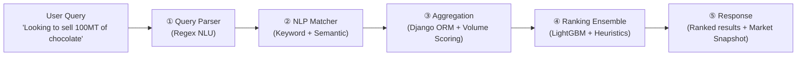
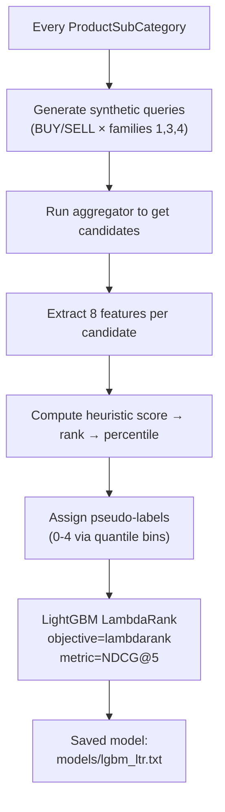

# ZaraiLink Search Engine — Technical Walkthrough

## Architecture Overview

The search engine is a **5-stage pipeline** that turns natural language trade queries into ranked counterparty results.



| Stage | File | Uses NLP? | Uses ML? |
|-------|------|-----------|----------|
| ① Query Parser | [query_parser.py](file:///c:/Users/Dell/Documents/ZaraiLink/backend/search/services/query_parser.py) | ❌ Pure regex/rules | ❌ |
| ② NLP Matcher | [nlp.py](file:///c:/Users/Dell/Documents/ZaraiLink/backend/search/services/nlp.py) | ✅ SentenceTransformers | ✅ Pretrained embeddings |
| ③ Aggregation | [aggregation.py](file:///c:/Users/Dell/Documents/ZaraiLink/backend/search/services/aggregation.py) | ❌ | ❌ DB queries only |
| ④ Ranking | [ranking_ltr.py](file:///c:/Users/Dell/Documents/ZaraiLink/backend/search/services/ranking_ltr.py) | ❌ | ✅ LightGBM LambdaRank |
| ⑤ Orchestration | [views.py](file:///c:/Users/Dell/Documents/ZaraiLink/backend/search/views.py) | ❌ | ❌ |

---

## ① Query Parser — Regex-Based NLU

**File:** [query_parser.py](file:///c:/Users/Dell/Documents/ZaraiLink/backend/search/services/query_parser.py)

Turns `"Buyers in Afghanistan who pay above $500"` into structured JSON. **No ML** — purely regex + scoring rules.

### What It Extracts

| Field | Method | Example |
|-------|--------|---------|
| [intent](file:///c:/Users/Dell/Documents/ZaraiLink/backend/search/services/query_parser.py#117-141) | Phrase scoring (BUY_SCORES vs SELL_SCORES dict) | "buyers" → SELL (+3), "who pay" → SELL (+5) |
| `product` | Leftover text after stripping keywords/stopwords | "chocolate", "refined sugar" |
| `country_filter` | Regex match against known country list + fuzzy match (difflib, cutoff=0.85) | "Afghanistan" → `["Afghanistan"]` |
| `volume_mt` | Regex: [(\d+)\s*(mt\|tons\|kg)](file:///c:/Users/Dell/Documents/ZaraiLink/backend/search/services/ranking_ltr.py#166-177) | "100MT" → `100.0` |
| `price_floor/ceiling` | Regex: `above\|below + $\d+` | "above $500" → `price_floor: 500` |
| [time_range](file:///c:/Users/Dell/Documents/ZaraiLink/backend/search/views.py#306-355) | Regex: `Q1 2025`, `last 6 months` | Parsed to date range |
| `family` | Priority classification (1-9) based on extracted filters | Family 3 = Volume-Aware, 4 = Price-Constrained |
| `scope` | From frontend toggle or inferred | "PAKISTAN" or "WORLDWIDE" |

### Multi-Intent Splitting

Queries with `;` or [and](file:///c:/Users/Dell/Documents/ZaraiLink/backend/search/management/commands/build_search_index.py#12-42) (where the right side has its own intent keyword) get split into sub-intents and merged:

```
"Buy dextrose under $500; and sell chocolate" → 2 sub-intents, merged
```

---

## ② NLP Matcher — Hybrid Product Matching

**File:** [nlp.py](file:///c:/Users/Dell/Documents/ZaraiLink/backend/search/services/nlp.py)

Maps the extracted product term (e.g., `"chocolate"`) to [ProductSubCategory](file:///c:/Users/Dell/Documents/ZaraiLink/backend/trade_data/models.py#44-51) IDs. **Uses ML** (pretrained embeddings).

### Two-Pass Matching

**Pass 1 — Keyword (High Precision):**
```python
ProductSubCategory.objects.filter(name__icontains="chocolate")
# → "Coverlux Chocolate Milk Compound Drops", "Chocolate" (score: 1.0)
```

**Pass 2 — Semantic Search (High Recall):**
```python
model = SentenceTransformer('all-MiniLM-L6-v2')  # 384-dim embeddings
query_vec = model.encode(["chocolate"])
scores = cosine_similarity(query_vec, precomputed_index)
# Finds related products like "Cocoa Powder" even if "chocolate" isn't in the name
```

- The semantic index is prebuilt via `python manage.py build_search_index` — encodes all [ProductSubCategory](file:///c:/Users/Dell/Documents/ZaraiLink/backend/trade_data/models.py#44-51) names into a pickle file ([build_search_index.py](file:///c:/Users/Dell/Documents/ZaraiLink/backend/search/management/commands/build_search_index.py))
- Semantic matches ≥ 0.4 cosine similarity are kept
- Keyword matches override semantic (score=1.0 vs cosine score)

### Filter-Only Queries

If the parser extracts no product (e.g., `"Buyers in Afghanistan who pay above $500"`), NLP is **skipped entirely** and the aggregator searches across all products.

---

## ③ Aggregation — Database Retrieval + Volume Scoring

**File:** [aggregation.py](file:///c:/Users/Dell/Documents/ZaraiLink/backend/search/services/aggregation.py)

Takes subcategory IDs + filters → queries PostgreSQL → returns counterparty candidates.

### Intent × Scope Matrix

The aggregation logic pivots on *who* you're looking for based on your intent and scope. Since data comes from Pakistan's trade records:

| Intent | Scope | Trade Type | Target (we return) | Country Field |
|--------|-------|------------|---------------------|---------------|
| BUY | WORLDWIDE | IMPORT | Sellers | origin_country |
| BUY | PAKISTAN | EXPORT | Sellers | origin_country |
| SELL | WORLDWIDE | EXPORT | Buyers | destination_country |
| SELL | PAKISTAN | IMPORT | Buyers | destination_country |

### Hard Filters Applied at DB Level

- **Country filter** → `WHERE destination_country IN ('Afghanistan')`
- **Price floor/ceiling** → `WHERE usd_per_mt >= 500`
- **Time range** → `WHERE reporting_date BETWEEN ...`

### Volume Compatibility Scoring (Soft — NOT Hard Filter)

When a volume is requested (e.g., 100MT), we do **not** hard-filter by volume. Instead:

1. Fetch all buyers, aggregate: `total_volume`, `max_shipment_vol`, `avg_shipment_vol`
2. **Soft floor** — drop only extreme mismatches: `max_ship < 0.3×V AND total_vol < 0.5×V`
3. Score each buyer:

```
VolumeScore = 0.5 × min(max_single_shipment / V, 1.0)
            + 0.3 × min(total_volume / V, 1.0)
            + 0.2 × min(avg_shipment / V, 1.0)
```

4. Label: `Strong` (≥0.8), `Good` (≥0.5), `Partial` (≥0.3), `Low` (<0.3)

---

## ④ Ranking — LightGBM LambdaRank + Heuristic Ensemble

**File:** [ranking_ltr.py](file:///c:/Users/Dell/Documents/ZaraiLink/backend/search/services/ranking_ltr.py)

This is the **ML-based** ranking layer. It uses a **70/30 ensemble** of heuristic scores and a trained LightGBM LambdaRank model.

### Feature Vector (8 features per candidate)

Extracted by `FeatureExtractor.extract()`:

| # | Feature | Source |
|---|---------|--------|
| 1 | `log_volume` | `log(1 + total_volume)` |
| 2 | `log_price` | `log(1 + avg_price)` |
| 3 | `shipment_freq` | Number of shipments |
| 4 | `inv_recency` | `1 / (days_since_last + 1)` |
| 5 | `volume_fit_score` | 0-3 from volume_fit label |
| 6 | `scope_match` | Always 1.0 (post-filter) |
| 7 | `country_match` | 1.0 if in query countries, 0.5 neutral, 0.0 mismatch |
| 8 | `price_fit` | 1.0 if within ceiling, 0.0 otherwise |

### Family-Aware Heuristic Weights

Different query families emphasize different features:

| Family | Top Weighted Feature | Weight |
|--------|---------------------|--------|
| 1 — Discovery | volume_fit | 1.5× |
| 2 — Country-Filtered | country_match | 3.0× |
| 3 — Volume-Aware | volume_fit | 3.0× |
| 4 — Price-Constrained | price_fit | 3.0× |
| 5 — Time-Constrained | inv_recency | 3.0× |

### Ensemble Scoring

```
FinalScore = 0.7 × HeuristicScore + 0.3 × LTR_Score
```

- **Heuristic score**: weighted dot product of features × family weights
- **LTR score**: LightGBM prediction (if model exists; otherwise 0 → pure heuristic fallback)

### How the LTR Model Is Trained

**Training script:** [train_ltr.py](file:///c:/Users/Dell/Documents/ZaraiLink/backend/search/services/train_ltr.py)

**Dataset builder:** [ltr_dataset_builder.py](file:///c:/Users/Dell/Documents/ZaraiLink/backend/search/services/ltr_dataset_builder.py)



Key details:
- **No human labels** — uses heuristic-ranked candidates as ground truth (pseudo-labeling)
- Labels: percentile-rank → bins: top 20% = label 4, next 20% = 3, etc.
- 80/20 train/val split (group-aware — queries stay intact)
- LambdaRank params: `learning_rate=0.05`, `num_leaves=31`, early stopping at 10 rounds
- Model is serialized to `search/models/lgbm_ltr.txt`

> [!NOTE]
> Since labels are derived from the *same* heuristics used in the ensemble, the LTR model essentially learns to *approximate and generalize* the heuristic scoring — it can discover non-linear feature interactions the weighted sum misses, but it is not learning from real user clicks.

---

## ⑤ Response Assembly

**File:** [views.py](file:///c:/Users/Dell/Documents/ZaraiLink/backend/search/views.py)

Final orchestration:

1. **Family-based result cap**: Family 6 (Recommendation) queries return only top N (`"Top 3 dextrose suppliers"` → 3 results)
2. **Market snapshot**: avg price, top country, total count
3. **Response payload**: `results[]`, `parsed_query`, `matched_subcategories`, `market_snapshot`

---

## Summary: Where NLP & ML Actually Run

| Technology | Where | What It Does |
|-----------|-------|--------------|
| **SentenceTransformer** (all-MiniLM-L6-v2) | NLP Matcher (Stage ②) | Encodes product names → 384-dim vectors for semantic search |
| **Cosine Similarity** (sklearn) | NLP Matcher (Stage ②) | Finds similar products when keyword match fails |
| **LightGBM LambdaRank** | Ranking (Stage ④) | Learns non-linear ranking from pseudo-labeled data |
| **Regex + Heuristics** | Parser (Stage ①), Ranking fallback (Stage ④) | Intent detection, filter extraction, weighted scoring |

The system is **hybrid**: NLP for product understanding, ML for ranking, rules everywhere else.
