# ZaraiLink: Complete Deep Dive Walkthrough

> **For Absolute Beginners** - Assumes zero prior knowledge of Django, React, APIs, or databases

---

## 📋 Table of Contents

1. [Part 1: Introduction & Overview](#part-1-introduction--overview)
2. [Part 2: Database Schema](#part-2-database-schema)
3. [Part 3: Backend Architecture](#part-3-backend-architecture)
4. [Part 4: Frontend Architecture](#part-4-frontend-architecture)
5. [Part 5: Data Flows & Key Features](#part-5-data-flows--key-features)
6. [Part 6: AI & Smart Features](#part-6-ai--smart-features-deep-dive)
7. [Part 7: Performance & Optimizations](#part-7-performance--optimizations)
8. [Part 8: Developer Operations (Docker, Tests, APIs)](#part-8-developer-operations--technical-reference)
9. [Part 9: Trade Data & Link Prediction Algorithms](#part-9-trade-data--link-prediction-algorithms)
10. [Part 10: Custom Hooks & Frontend Utilities](#part-10-custom-hooks--frontend-utilities)
11. [AI Features & Capabilities Deep Dive](#ai-features--capabilities-deep-dive)
12. [Appendix A: Complete File Reference](#appendix-a-complete-file-reference)
13. [Glossary](#glossary)

---

# Part 1: Introduction & Overview

**Quick Summary:** ZaraiLink is an agricultural trade intelligence platform built with React (frontend) and Django (backend), using PostgreSQL database. It helps businesses find trading partners, access trade data, get market intelligence, and unlock verified contacts using a token system.

---

# Part 2: Database Schema

**Key Models:**
- **User** - Custom auth with email and token balance
- **Company** - Core company profile
- **KeyContact** - Private contacts (locked by default)
- **TradeCompany** - Extended trade statistics
- **SubscriptionPlan** - Token packages

---

# Part 3: Backend Architecture

**Key Concepts:**
- **ViewSet** - Handles CRUD operations
- **Serializer** - Converts models ↔ JSON
- **Routing** - Project URLs → App URLs → ViewSets
- **Session Auth** - Cookie-based authentication

---

# Part 4: Frontend Architecture

**Key Concepts:**
- **Component** - Reusable UI piece
- **State** - Data React remembers
- **Context** - Global state (auth, user)
- **useEffect** - Handle side effects (API calls)
- **useParams** - Get URL parameters

---

# Part 5: Data Flows & Key Features

**Key Flows:**
1. **Login** - User → React → Django → Database → Session
2. **Search** - Filter → API Request → Database Query → JSON → Display
3. **Unlock** - Check balance → Deduct token → Create record → Show contact

---

## Glossary

| Term | Simple Definition |
|------|-------------------|
| **API** | Way for programs to talk (like a waiter) |
| **Component** | Reusable UI piece (like LEGO block) |
| **Context** | Global state in React |
| **Django** | Python web framework |
| **ForeignKey** | Link to another database table |
| **Hook** | Special React function (useState, useEffect) |
| **JSON** | Data format for APIs |
| **Model** | Database table in Django |
| **Serializer** | Converts models ↔ JSON |
| **Session** | Server remembers you're logged in |
| **State** | Data React remembers |
| **Token** | Auth credential OR app currency |
| **ViewSet** | Django class for CRUD operations |

---

## Project Statistics

- **Backend Framework:** Django 4.2.7
- **Frontend Library:** React 19.2.0
- **Database:** PostgreSQL
- **Django Apps:** 6 (accounts, companies, trade_ledger, trade_data, subscriptions, market_intel)
- **Database Models:** 30+
- **React Components:** 20+
- **API Endpoints:** 15+ main endpoints with custom actions

---

## File Structure Quick Reference

```
ZaraiLink/
├── backend/
│   ├── zarailink/          # Settings & config
│   ├── accounts/           # Authentication
│   ├── companies/          # Company directory
│   ├── trade_ledger/       # Trade intelligence
│   ├── trade_data/         # Raw transactions
│   ├── subscriptions/      # Plans & tokens
│   └── market_intel/       # Alerts & news
│
└── frontend/
    └── src/
        ├── context/        # Global state
        ├── components/     # UI components
        │   ├── Auth/
        │   ├── Dashboard/
        │   ├── TradeDirectory/
        │   └── TradeIntelligence/
        └── App.js          # Main router
```

---

## Next Steps

1. **Read Individual Parts** - Each part has extensive detail and examples
2. **Explore Code** - Open files referenced in the walkthrough
3. **Test Features** - Try login, search, filtering in running app
4. **Modify & Experiment** - Change filters, add fields, customize UI
5. **Build New Features** - Use patterns from this guide

---

## Resources

- **Django Documentation:** https://docs.djangoproject.com/
- **React Documentation:** https://react.dev/
- **Django REST Framework:** https://www.django-rest-framework.org/
- **PostgreSQL Documentation:** https://www.postgresql.org/docs/

---

**Document Structure:**
- **Main Document** - You are here (overview and navigation)
- **Part 1** - Introduction, tech stack, key concepts
- **Part 2** - Complete database schema with all models
- **Part 3** - Django backend architecture and patterns
- **Part 4** - React frontend components and hooks
- **Part 5** - Data flows, features, and glossary

**Generated:** December 3, 2024  
**Version:** 1.0  
**For:** ZaraiLink Team - Documentation & Presentation

---

# ZaraiLink Deep Dive Walkthrough - Part 1: Introduction & Overview

## What is ZaraiLink?

**ZaraiLink** is an Agricultural Trade Intelligence Platform that connects businesses in the agriculture sector.

**What it does:**
- **Find Trading Partners** - Search for suppliers and buyers
- **Access Trade Data** - View import/export statistics  
- **Get Market Intelligence** - Track price trends and alerts
- **Unlock Contacts** - Access verified business contacts using tokens

**Real-World Analogy:** Think of it as **LinkedIn + Bloomberg + Yellow Pages** for agricultural businesses.

---

## Technology Stack

### The Big Picture


### Technologies Used

| Technology | Purpose | Why This Choice |
|------------|---------|-----------------|
| **React** | Build user interface | Fast, interactive, reusable components |
| **Django** | Handle business logic | Built-in auth, admin panel, security |
| **PostgreSQL** | Store data | Handles complex relationships well |
| **Redis** | Caching & Fast Retreival | Reduces DB load, speeds up repeated API calls |
| **GNN (Graph Neural Net)** | AI Recommendations | Powers "Similar Companies" & Link Prediction |
| **Scikit-Learn** | Logic & Metrics | Cosine Similarity for vector comparisons |
| **Puppeteer** | PDF Generation | High-fidelity export of dashboard views |
| **AuditLog** | Security & Tracking | Tracks all changes to sensitive models |

### For Complete Beginners

**What is a Framework?**
A framework is like a construction kit. Instead of building everything from scratch, you get pre-built parts that work together.

**What is an API?**
API = Application Programming Interface. It's like a waiter in a restaurant:
- You (frontend) tell the waiter (API) what you want
- Waiter takes your order to the kitchen (backend)
- Kitchen prepares food (processes data)
- Waiter brings it back to you (returns response)

**What is JSON?**
JSON is a data format both humans and computers can read:
```json
{
  "name": "Rice Mills Ltd",
  "country": "Pakistan",
  "products": ["Basmati Rice", "Brown Rice"]
}
```

---

## Project Structure

```
ZaraiLink/
├── backend/              # Django (Python)
│   ├── zarailink/       # Settings & config
│   ├── accounts/        # User login/signup
│   ├── companies/       # Company directory
│   ├── trade_ledger/    # Trade data
│   ├── trade_data/      # Raw transactions
│   ├── subscriptions/   # Payment plans
│   └── market_intel/    # Market alerts
│
└── frontend/            # React (JavaScript)
    └── src/
        ├── components/  # UI pieces
        ├── context/     # Global state
        └── App.js       # Main app
```

### Why Separate Frontend and Backend?

**Separation of Concerns:**
- **Backend** = "What data exists and who can access it"
- **Frontend** = "How to display that data"

**Benefits:**
- Can update UI without changing business logic
- Can have multiple frontends (web, mobile app)
- Easier to test and maintain

---

## How the Application Works

### Complete Request Flow


### Step-by-Step Example: User Searches for Rice Suppliers

1. **User Action:** Selects "Rice" from sector dropdown
2. **React:** Updates filter state, triggers useEffect
3. **API Call:** `GET http://localhost:8000/api/companies/?sector=rice&role=supplier`
4. **Django:** Receives request, checks permissions
5. **Database Query:** `SELECT * FROM companies WHERE sector='rice' AND role='supplier'`
6. **Django:** Converts database rows to JSON
7. **React:** Receives JSON, updates component state
8. **Browser:** Re-renders page with filtered companies

---

## Key Concepts

### What is a Database?

**Analogy:** A filing cabinet with organized drawers

- **Table** = Drawer (e.g., "Companies")
- **Row** = Folder (e.g., one specific company)
- **Column** = Field in folder (e.g., name, address)
- **Relationship** = Reference between folders

### What is a Component?

**Analogy:** LEGO blocks

```javascript
// CompanyCard component - reusable piece
function CompanyCard({ company }) {
  return (
    <div className="card">
      <h3>{company.name}</h3>
      <p>{company.country}</p>
    </div>
  );
}

// Use it multiple times
<CompanyCard company={company1} />
<CompanyCard company={company2} />
<CompanyCard company={company3} />
```

### What is State?

**Analogy:** A whiteboard that React watches

When you write new content on the whiteboard (update state), React automatically redraws the UI.

```javascript
const [companies, setCompanies] = useState([]);  // Empty whiteboard

// Later... write on whiteboard
setCompanies([{name: "Rice Mills"}, {name: "Cotton Export"}]);

// React automatically updates what user sees!
```

---

## Authentication Flow


**Session Cookie Explained:**
- Like a library card that proves you're a member
- Stored in your browser after login
- Sent automatically with every request
- Expires after 2 weeks (or when you logout)

---

## Next Sections

This walkthrough continues in:
- **Part 2:** Database Schema Deep Dive
- **Part 3:** Backend Architecture  
- **Part 4:** Frontend Architecture
- **Part 5:** Data Flows & Features

# ZaraiLink Deep Dive Walkthrough - Part 2: Database Schema

## Database Overview

ZaraiLink uses **PostgreSQL** with **30+ models** organized across 6 Django apps.

### Entity Relationship Diagram


---

## Accounts App Models

### User Model

**File:** [backend/accounts/models.py](file:///d:/Salman%20Adnan/HU/7th%20Semester/FYP/Coding/backend/accounts/models.py)

**Purpose:** Store user account information with custom authentication

```python
class User(AbstractUser):
    email = models.EmailField(unique=True)
    email_verified = models.BooleanField(default=False)
    verification_token = models.UUIDField(default=uuid.uuid4, unique=True)
    token_balance = models.IntegerField(default=0)
    country = models.CharField(max_length=100)
    phone_number = models.CharField(max_length=30)
    job_title = models.CharField(max_length=100)
```

**Field Explanations:**

| Field | Type | Purpose | Example Value |
|-------|------|---------|---------------|
| [email](file:///d:/Salman%20Adnan/HU/7th%20Semester/FYP/Coding/backend/accounts/views.py#251-282) | EmailField | Login credential | "farmer@example.com" |
| `first_name` | CharField | User's first name | "Ahmed" |
| `email_verified` | BooleanField | Has verified email? | True |
| [verification_token](file:///d:/Salman%20Adnan/HU/7th%20Semester/FYP/Coding/backend/accounts/models.py#43-49) | UUIDField | Unique verification link | "550e8400-e29..." |
| `token_balance` | IntegerField | Contact unlock credits | 50 |
| `country` | CharField | User location | "Pakistan" |

**Why Custom User Model?**
- Django default uses `username`; we use [email](file:///d:/Salman%20Adnan/HU/7th%20Semester/FYP/Coding/backend/accounts/views.py#251-282) (more business-friendly)
- Added `token_balance` for contact unlocking
- Added `email_verified` for security

**Example Data:**

```
| id | email               | first_name | email_verified | token_balance | country  |
|----|---------------------|------------|----------------|---------------|----------|
| 1  | ahmed@company.pk    | Ahmed      | True           | 50            | Pakistan |
| 2  | sara@export.com     | Sara       | True           | 120           | Pakistan |
```

### UserAlertPreference Model

**Purpose:** Track user notification preferences

```python
class UserAlertPreference(models.Model):
    user = models.OneToOneField(User, on_delete=models.CASCADE)
    followed_products = models.JSONField(default=list)
    followed_countries = models.JSONField(default=list)
    notify_email = models.BooleanField(default=True)
    frequency = models.CharField(max_length=50, default='daily')
```

**One-to-One Relationship:** Each user has exactly one preference record

---

## Companies App Models

### Company Model

**Purpose:** Main company profile in trade directory

```python
class Company(models.Model):
    name = models.CharField(max_length=255)
    legal_name = models.CharField(max_length=255)
    country = models.CharField(max_length=100)
    province = models.CharField(max_length=100)
    district = models.CharField(max_length=100)
    sector = models.ForeignKey(Sector, on_delete=models.SET_NULL)
    company_role = models.ForeignKey(CompanyRole, on_delete=models.SET_NULL)
    company_type = models.ForeignKey(CompanyType, on_delete=models.SET_NULL)
    verification_status = models.CharField(choices=[...], default='unverified')
    year_established = models.IntegerField()
```

**Verification Statuses:**
- `unverified` - Not yet verified
- `pending` - Verification in progress
- `verified` - Basic verification complete
- `premium` - Premium verified company

**ForeignKey Relationships:**


**Example Data:**

```
| id | name                  | country  | sector_id | role_id | verification_status |
|----|-----------------------|----------|-----------|---------|---------------------|
| 1  | Sialkot Rice Mills    | Pakistan | 2         | 6       | verified            |
| 2  | Karachi Cotton Export | Pakistan | 1         | 7       | premium             |
```

### Sector Model

**Purpose:** Product categories (Rice, Cotton, Textiles)

```python
class Sector(models.Model):
    name = models.CharField(max_length=150)
    description = models.TextField(blank=True)
```

**Example Data:**
```
| id | name        | description                    |
|----|-------------|--------------------------------|
| 1  | Cotton      | Cotton and cotton products     |
| 2  | Rice        | Rice varieties and processing  |
| 3  | Textiles    | Fabric and garments            |
```

### CompanyRole Model

**Purpose:** Company's function in trade (Supplier, Buyer, Distributor)

```python
class CompanyRole(models.Model):
    name = models.CharField(max_length=50)
    description = models.TextField(blank=True)
```

**Common Roles:**
- Supplier / Manufacturer
- Buyer / Importer
- Distributor / Wholesaler
- Retailer
- Service Provider

### CompanyType Model

**Purpose:** Legal/structural classification

```python
class CompanyType(models.Model):
    name = models.CharField(max_length=150)
    description = models.TextField(blank=True)
```

**Common Types:**
- Private Limited Company
- Public Limited Company
- Partnership
- Sole Proprietorship
- Cooperative

### CompanyProduct Model

**Purpose:** Products offered by companies

```python
class CompanyProduct(models.Model):
    company = models.ForeignKey(Company, on_delete=models.CASCADE, related_name='products')
    name = models.CharField(max_length=255)
    variety = models.CharField(max_length=100)  # "Basmati", "Super Kernel"
    value_added = models.CharField(max_length=255)  # "Organic Certified"
    hsn_code = models.CharField(max_length=20)  # "1006.30"
```

**HSN Code Explained:**
- **HSN** = Harmonized System Nomenclature
- International standard for classifying traded products
- Example: "1006.30" = Milled rice

**Relationship:**
- Many products → One company
- Uses `related_name='products'` to access from company

**Example:**
```python
company = Company.objects.get(id=1)
products = company.products.all()  # Access via related_name
```

### KeyContact Model

**Purpose:** Private contact information (phone, email, WhatsApp)

```python
class KeyContact(models.Model):
    company = models.ForeignKey(Company, on_delete=models.CASCADE, related_name='key_contacts')
    name = models.CharField(max_length=255)
    designation = models.CharField(max_length=150)
    phone = models.CharField(max_length=50)
    whatsapp = models.CharField(max_length=50)
    email = models.EmailField(max_length=255)
    is_public = models.BooleanField(default=False)
```

**is_public Field:**
- `True` = Free to view (no tokens required)
- `False` = Costs 1 token to unlock

**Example Data:**
```
| id | company_id | name        | designation      | phone          | is_public |
|----|------------|-------------|------------------|----------------|-----------|
| 1  | 1          | Ahmed Khan  | Export Manager   | +92-300-123456 | False     |
| 2  | 1          | Sara Ali    | Sales Executive  | +92-321-654321 | False     |
| 3  | 2          | Info Desk   | General Inquiry  | +92-42-1234567 | True      |
```

### KeyContactUnlock Model

**Purpose:** Track which users unlocked which contacts

```python
class KeyContactUnlock(models.Model):
    user = models.ForeignKey(User, on_delete=models.CASCADE, related_name='unlocked_contacts')
    key_contact = models.ForeignKey(KeyContact, on_delete=models.CASCADE, related_name='unlocks')
    unlocked_at = models.DateTimeField(auto_now_add=True)
    
    class Meta:
        unique_together = ['user', 'key_contact']
```

**unique_together:** Prevents same user from unlocking same contact twice

**Example:**
```
| id | user_id | key_contact_id | unlocked_at         |
|----|---------|----------------|---------------------|
| 1  | 1       | 1              | 2024-12-01 10:30:00 |
| 2  | 1       | 2              | 2024-12-01 10:35:00 |
| 3  | 2       | 1              | 2024-12-02 14:20:00 |
```

---

## Trade Ledger App Models

### TradeCompany Model

**Purpose:** Extended company info with trade statistics

```python
class TradeCompany(models.Model):
    company = models.OneToOneField(Company, on_delete=models.CASCADE, related_name='trade_data')
    estimated_revenue = models.DecimalField(max_digits=15, decimal_places=2)
    trade_volume = models.DecimalField(max_digits=15, decimal_places=2)
    active_since = models.DateField()
    is_importer = models.BooleanField(default=False)
    is_exporter = models.BooleanField(default=False)
```

**OneToOneField:** Each Company has maximum one TradeCompany record

**Example Data:**
```
| id | company_id | estimated_revenue | trade_volume | is_exporter | is_importer |
|----|------------|-------------------|--------------|-------------|-------------|
| 1  | 1          | 10000000.00       | 50000.00     | True        | False       |
| 2  | 2          | 5500000.00        | 35000.00     | True        | True        |
```

### TradeProduct Model

**Purpose:** Products being traded with statistics

```python
class TradeProduct(models.Model):
    company = models.ForeignKey(TradeCompany, on_delete=models.CASCADE, related_name='products')
    category = models.ForeignKey(ProductCategory, on_delete=models.SET_NULL)
    product_name = models.CharField(max_length=200)
    hs_code = models.CharField(max_length=10)
    avg_price = models.DecimalField(max_digits=12, decimal_places=2)
    currency = models.CharField(max_length=3, choices=CURRENCY_CHOICES)
    volume = models.DecimalField(max_digits=15, decimal_places=2)
    unit = models.CharField(max_length=20, choices=UNIT_CHOICES)
    yoy_growth = models.DecimalField(max_digits=6, decimal_places=2)
```

**CURRENCY_CHOICES:** USD, PKR, EUR, GBP  
**UNIT_CHOICES:** kg, ton, lb, unit, box, container

**yoy_growth:** Year-over-Year growth percentage

**Example:**
```
| id | company_id | product_name | avg_price | currency | volume | unit | yoy_growth |
|----|------------|--------------|-----------|----------|--------|------|------------|
| 1  | 1          | Basmati Rice | 850.00    | USD      | 25000  | ton  | 15.5       |
| 2  | 1          | Brown Rice   | 720.00    | USD      | 12000  | ton  | 8.2        |
```

### TradePartner Model

**Purpose:** Trading partners by country

```python
class TradePartner(models.Model):
    company = models.ForeignKey(TradeCompany, on_delete=models.CASCADE, related_name='partners')
    country = models.CharField(max_length=100)
    port_name = models.CharField(max_length=200)
    trade_volume = models.DecimalField(max_digits=15, decimal_places=2)
    percentage_share = models.DecimalField(max_digits=5, decimal_places=2)
    is_export = models.BooleanField(default=True)
```

**percentage_share:** What % of total trade is with this partner

**Example:**
```
| id | company_id | country | trade_volume | percentage_share | is_export |
|----|------------|---------|--------------|------------------|-----------|
| 1  | 1          | UAE     | 15000.00     | 30.00            | True      |
| 2  | 1          | China   | 12000.00     | 24.00            | True      |
```

### TradeTrend Model

**Purpose:** Historical trends over time

```python
class TradeTrend(models.Model):
    company = models.ForeignKey(TradeCompany, on_delete=models.CASCADE, related_name='trends')
    product = models.ForeignKey(TradeProduct, on_delete=models.CASCADE, related_name='trends')
    month = models.IntegerField(choices=MONTH_CHOICES)
    year = models.IntegerField()
    volume = models.DecimalField(max_digits=15, decimal_places=2)
    avg_price = models.DecimalField(max_digits=12, decimal_places=2)
    yoy_volume_growth = models.DecimalField(max_digits=6, decimal_places=2)
    
    class Meta:
        unique_together = ['company', 'product', 'month', 'year']
```

**unique_together:** One trend record per company-product-month-year combination

---

## Subscriptions App Models

### SubscriptionPlan Model

```python
class SubscriptionPlan(models.Model):
    plan_name = models.CharField(max_length=150)
    price = models.DecimalField(max_digits=10, decimal_places=2)
    currency = models.CharField(max_length=10, default='USD')
    tokens_included = models.IntegerField()
    description = models.TextField()
    features = models.JSONField(default=dict)
```

**features JSONField Example:**
```json
{
  "max_unlocks_per_month": 50,
  "export_reports": true,
  "api_access": false
}
```

### RedeemCode Model

```python
class RedeemCode(models.Model):
    code = models.CharField(max_length=16, unique=True)
    plan = models.ForeignKey(SubscriptionPlan, on_delete=models.CASCADE)
    status = models.CharField(choices=[
        ('active', 'Active'),
        ('redeemed', 'Redeemed'),
        ('expired', 'Expired')
    ])
    redeemed_by = models.ForeignKey(User, on_delete=models.SET_NULL)
    created_at = models.DateTimeField(auto_now_add=True)
    redeemed_at = models.DateTimeField()
```

**Code Generation:**
```python
def generate_code(length=12):
    chars = string.ascii_uppercase + string.digits
    chars = chars.replace('0', '').replace('O', '').replace('I', '').replace('1', '')
    return ''.join(secrets.choice(chars) for _ in range(length))
```

---

## Market Intelligence App Models

### Alert Model

```python
class Alert(models.Model):
    headline = models.CharField(max_length=512)
    summary = models.TextField()
    category = models.CharField(max_length=100)
    product = models.ForeignKey(Sector, on_delete=models.SET_NULL)
    country = models.CharField(max_length=100)
    severity = models.CharField(choices=[
        ('low', 'Low'),
        ('medium', 'Medium'),
        ('high', 'High'),
        ('critical', 'Critical')
    ])
    detected_at = models.DateTimeField()
```

**Alert Categories:**
- Price Surge
- Supply Disruption
- Demand Spike
- Policy Change
- Market Opportunity

### NewsArticle Model

```python
class NewsArticle(models.Model):
    alert = models.ForeignKey(Alert, on_delete=models.CASCADE, related_name='news_articles')
    source = models.CharField(max_length=255)
    url = models.URLField(max_length=1024)
    title = models.CharField(max_length=512)
    published_at = models.DateTimeField()
```

---

## Relationship Types Summary

### One-to-Many (1:N)
- Company → Products
- Company → KeyContacts
- TradeCompany → TradeProducts

### One-to-One (1:1)
- Company → TradeCompany
- User → UserAlertPreference

### Many-to-Many (N:M)
- Users ↔ KeyContacts (through KeyContactUnlock)
- Users ↔ Alerts (through SavedAnalysis)

---

## Next: Part 3 - Backend Architecture

# ZaraiLink Deep Dive Walkthrough - Part 3: Backend Architecture

## Django Project Structure

```
backend/
├── zarailink/          # Project configuration
│   ├── settings.py     # All configuration
│   ├── urls.py         # Main URL routing
│   └── wsgi.py         # Web server interface
│
├── accounts/           # User authentication
│  ├── models.py        # User model
│   ├── views.py        # Login/signup/verify
│   └── urls.py         # /accounts/* routes
│
├── companies/          # Company directory
│   ├── models.py       # Company, Product, Contact
│   ├── serializers.py  # JSON conversion  
│   ├── views.py        # API endpoints
│   └── urls.py         # /api/companies/* routes
│
└── trade_ledger/       # Trade intelligence
    ├── models.py       # Trade data models
    ├── serializers.py  # Trade JSON conversion
    ├── views.py        # Trade API endpoints
    └── urls.py         # /api/trade-ledger/* routes
```

---

## URL Routing System

### Two-Level Routing

**Level 1: Project URLs** ([zarailink/urls.py](file:///d:/Salman%20Adnan/HU/7th%20Semester/FYP/Coding/backend/zarailink/urls.py))

```python
urlpatterns = [
    path('admin/', admin.site.urls),
    path('accounts/', include('accounts.urls')),
    path('api/', include('companies.urls')),
    path('api/subscriptions/', include('subscriptions.urls')),
    path('api/trade-ledger/', include('trade_ledger.urls')),
]
```

### Middleware & Security Layer
ZaraiLink uses a robust middleware chain in `settings.py` to handle security, sessions, and auditing:

1.  **SecurityMiddleware**: Enforces SSL/TLS (in production).
2.  **CorsMiddleware**: Allows React frontend (port 3000) to communicate with Django (port 8000).
3.  **AuditlogMiddleware**: Automatically tracks changes to sensitive models (e.g., Company updates).
4.  **SessionMiddleware**: Manages user sessions via secure cookies.

### Logging System
The system uses a custom logging configuration to track errors and debug info:
- **Console Handler**: Outputs `DEBUG` level logs to terminal during development.
- **File Handler**: Writes `ERROR` level occurrences to `debug.log`.
- **ZaraiLink Logger**: Project-specific logger for tracing business logic flow.
```

**What this means:**
- `/admin/*` → Django admin panel
- `/accounts/*` → Forward to accounts app
- `/api/*` → Forward to companies app
- `/api/subscriptions/*` → Forward to subscriptions app

**Level 2: App URLs** ([companies/urls.py](file:///d:/Salman%20Adnan/HU/7th%20Semester/FYP/Coding/backend/companies/urls.py))

```python
router = DefaultRouter()
router.register(r'companies', CompanyViewSet, basename='companies')
router.register(r'key-contacts', KeyContactViewSet, basename='key-contacts')

urlpatterns = [
    path('', include(router.urls)),
    path('sectors/', SectorListView.as_view()),
    path('company-types/', CompanyTypeListView.as_view()),
]
```

**Router automatically creates:**
- `GET /api/companies/` → List all companies
- `GET /api/companies/42/` → Get company #42
- `POST /api/key-contacts/5/unlock/` → Custom action

---

## Views Explained

### What is a View?

A view is a Python function/class that:
1. Receives HTTP request
2. Processes it (queries database, checks permissions)
3. Returns HTTP response (usually JSON)

### ViewSet Pattern

```python
class CompanyViewSet(viewsets.ReadOnlyModelViewSet):
    queryset = Company.objects.filter(verification_status='verified')
    permission_classes = [AllowAny]
    
    def get_serializer_class(self):
        if self.action == 'list':
            return CompanyListSerializer  # Minimal data
        return CompanyDetailSerializer    # Full data
    
    def get_queryset(self):
        queryset = self.queryset
        sector = self.request.query_params.get('sector')
        if sector:
            queryset = queryset.filter(sector_id=sector)
        return queryset
```

**Breakdown:**

- **queryset:** Base dataset (all verified companies)
- **permission_classes:** Who can access? (`AllowAny`, `IsAuthenticated`)
- **get_serializer_class():** Which serializer to use
- **get_queryset():** Apply filters from URL parameters

### Example Request Flow

**User:** `GET /api/companies/?sector=2&role=6`

**Flow:**
1. Router → CompanyViewSet
2. [get_queryset()](file:///d:/Salman%20Adnan/HU/7th%20Semester/FYP/Coding/backend/companies/views.py#84-91) applies filters
3. Database: `SELECT * FROM companies WHERE sector_id=2 AND role_id=6`
4. [get_serializer_class()](file:///d:/Salman%20Adnan/HU/7th%20Semester/FYP/Coding/backend/companies/views.py#26-30) → [CompanyListSerializer](file:///d:/Salman%20Adnan/HU/7th%20Semester/FYP/Coding/backend/companies/serializers.py#75-85)
5. Serialize data → JSON
6. Return response

---

## Serializers Explained

### Purpose

Convert complex data (Django models) ↔ Simple formats (JSON)

### Basic Serializer

```python
class CompanyListSerializer(serializers.ModelSerializer):
    sector_name = serializers.CharField(source='sector.name', read_only=True)
    role_name = serializers.CharField(source='company_role.name', read_only=True)
    
    class Meta:
        model = Company
        fields = ['id', 'name', 'country', 'sector_name', 'role_name']
```

**Before serialization:**
```python
<Company: Sialkot Rice Mills>
```

**After serialization:**
```json
{
  "id": 1,
  "name": "Sialkot Rice Mills",
  "country": "Pakistan",
  "sector_name": "Rice",
  "role_name": "Supplier"
}
```

### Custom Fields with SerializerMethodField

```python
class TradeCompanySerializer(serializers.ModelSerializer):
    total_products = serializers.SerializerMethodField()
    top_products = serializers.SerializerMethodField()
    
    def get_total_products(self, obj):
        return obj.products.count()
    
    def get_top_products(self, obj):
        top = obj.products.order_by('-volume')[:3]
        return TradeProductSerializer(top, many=True).data
```

### Dynamic Serializer (Contact Locking)

```python
class KeyContactSerializer(serializers.ModelSerializer):
    is_unlocked = serializers.SerializerMethodField()
    
    def get_is_unlocked(self, obj):
        request = self.context.get('request')
        return KeyContactUnlock.objects.filter(
            user=request.user,
            key_contact=obj
        ).exists()
    
    def to_representation(self, instance):
        data = super().to_representation(instance)
        if not data['is_unlocked']:
            data['phone'] = "🔒 Locked"
            data['email'] = "🔒 Locked"
        return data
```

---

## Authentication System

### Session-Based Auth


### Login View Code

```python
@csrf_exempt
def api_login(request):
    data = json.loads(request.body)
    email = data.get('email')
    password = data.get('password')
    
    # Check if email is verified
    try:
        user_check = User.objects.get(email=email)
        if not user_check.email_verified:
            return JsonResponse({
                'error': 'Please verify your email first',
                'email_not_verified': True
            }, status=403)
    except User.DoesNotExist:
        pass
    
    # Authenticate
    user = authenticate(request, email=email, password=password)
    if user:
        login(request, user)  # Creates session
        return JsonResponse({
            'success': True,
            'user': {
                'name': f"{user.first_name} {user.last_name}",
                'email': user.email,
                'token_balance': user.token_balance
            }
        })
    else:
        return JsonResponse({'error': 'Invalid credentials'}, status=401)
```

### Email Verification

```python
def api_verify_email(request, token):
    try:
        user = User.objects.get(verification_token=token)
        
        if not user.is_verification_token_valid():
            return HttpResponseRedirect(
                f"{settings.FRONTEND_URL}/verify-email/{token}?status=expired"
            )
        
        user.email_verified = True
        user.save()
        
        return HttpResponseRedirect(
            f"{settings.FRONTEND_URL}/verify-email/{token}?status=verified"
        )
    except User.DoesNotExist:
        return HttpResponseRedirect(
            f"{settings.FRONTEND_URL}/verify-email/{token}?status=invalid"
        )
```

---

## Custom Actions & Advanced Views

### Contact Unlock Action

```python
@action(detail=True, methods=['post'], permission_classes=[IsAuthenticated])
@transaction.atomic
def unlock(self, request, pk=None):
    contact = self.get_object()
    user = request.user
    
    # Check if already unlocked
    if KeyContactUnlock.objects.filter(user=user, key_contact=contact).exists():
        return Response({'status': 'already_unlocked'})
    
    # Check if contact is public (free)
    if contact.is_public:
        KeyContactUnlock.objects.create(user=user, key_contact=contact)
        return Response({'status': 'success', 'tokens_charged': 0})
    
    # Check token balance
    if not user.has_tokens(1):
        return Response({
            'status': 'insufficient_tokens',
            'current_balance': user.token_balance
        }, status=402)
    
    # Deduct token and unlock
    user.deduct_tokens(1)
    KeyContactUnlock.objects.create(user=user, key_contact=contact)
    
    return Response({
        'status': 'success',
        'tokens_charged': 1,
        'remaining_balance': user.token_balance
    })
```

**@transaction.atomic:** Ensures all database operations succeed or all fail (no partial unlocks)

### Statistics Endpoint

```python
@action(detail=False, methods=['get'])
def statistics(self, request):
    queryset = self.get_queryset()  # Filtered companies
    product_id = request.query_params.get('product')
    
    stats = {}
    
    if product_id:
        products = TradeProduct.objects.filter(
            company__in=queryset,
            category_id=product_id
        )
        stats['avg_price'] = products.aggregate(Avg('avg_price'))['avg_price__avg']
        stats['total_volume'] = products.aggregate(Sum('volume'))['volume__sum']
    
    stats['total_companies'] = queryset.count()
    
    return Response(stats)
```

**Usage:** `GET /api/trade-ledger/companies/statistics/?product=2`

---

## Django Settings

### Key Settings

```python
# Database
DATABASES = {
    'default': {
        'ENGINE': 'django.db.backends.postgresql',
        'NAME': 'zarailink',
        'USER': 'postgres',
        'PASSWORD': os.getenv('DB_PASSWORD'),
        'HOST': 'localhost',
        'PORT': '5432',
    }
}

# Custom user model
AUTH_USER_MODEL = 'accounts.User'

# CORS (allow React to connect)
CORS_ALLOWED_ORIGINS = [
    "http://localhost:3000",
]
CORS_ALLOW_CREDENTIALS = True

# Session settings
SESSION_COOKIE_AGE = 1209600  # 2 weeks
SESSION_SAVE_EVERY_REQUEST = True

# Email (for verification)
EMAIL_BACKEND = 'django.core.mail.backends.smtp.EmailBackend'
EMAIL_HOST = 'smtp.gmail.com'
EMAIL_PORT = 587
EMAIL_USE_TLS = True
```

---

## Common Patterns

### Pattern 1: Filter by Query Params

```python
def get_queryset(self):
    queryset = self.queryset
    
    # Get filters from URL
    sector = self.request.query_params.get('sector')
    region = self.request.query_params.get('region')
    search = self.request.query_params.get('search')
    
    # Apply filters
    if sector:
        queryset = queryset.filter(sector_id=sector)
    if region:
        queryset = queryset.filter(province=region)
    if search:
        queryset = queryset.filter(
            Q(name__icontains=search) | Q(description__icontains=search)
        )
    
    return queryset
```

### Pattern 2: Nested Serializers

```python
class CompanyDetailSerializer(serializers.ModelSerializer):
    sector = SectorSerializer(read_only=True)
    products = CompanyProductSerializer(many=True, read_only=True)
    key_contacts = serializers.SerializerMethodField()
    
    def get_key_contacts(self, obj):
        contacts = obj.key_contacts.all()
        return KeyContactSerializer(
            contacts,
            many=True,
            context=self.context  # Pass request to check unlock status
        ).data
```

### Pattern 3: Permission Checking

```python
from rest_framework.permissions import BasePermission

class IsOwnerOrAdmin(BasePermission):
    def has_object_permission(self, request, view, obj):
        return obj.user == request.user or request.user.is_staff

# In view:
class MyViewSet(viewsets.ModelViewSet):
    permission_classes = [IsAuthenticated, IsOwnerOrAdmin]
```

---

## Next: Part 4 - Frontend Architecture


# ZaraiLink Deep Dive Walkthrough - Part 4: Frontend Architecture

## React Basics

### What is React?

React is a JavaScript library for building user interfaces using **components** (reusable UI pieces).

**Component Analogy:** Like LEGO blocks - each has a specific function, combine them to build complex UIs.

### Component Example

```javascript
function CompanyCard({ company }) {
  return (
    <div className="company-card">
      <h3>{company.name}</h3>
      <p>{company.country}</p>
      <span className="badge">{company.sector}</span>
    </div>
  );
}

// Use it multiple times
<CompanyCard company={company1} />
<CompanyCard company={company2} />
```

---

## Project Structure

```
frontend/src/
├── App.js                    # Main app component
├── index.js                  # Entry point
├── context/
│   └── AuthContext.js        # Global auth state
├── components/
│   ├── Auth/                 # Login, signup
│   ├── Dashboard/            # Dashboard page
│   ├── TradeDirectory/       # Find suppliers/buyers
│   └── TradeIntelligence/    # Trade ledger
└── services/
    └── api.js                # API calls (future)

### Advanced Frontend Features
The `App.js` includes performance and UX optimizations:

1.  **Lazy Loading (Code Splitting):**
    Heavy components are loaded only when needed using `React.lazy()` and `Suspense`:
    ```javascript
    const TradeLedger = React.lazy(() => import("./components/TradeIntelligence/TradeLedger"));
    ```

2.  **Toast Notifications:**
    A global `ToastProvider` wraps the app to show success/error messages anywhere without prop drilling.

3.  **Protected Routes:**
    The `<ProtectedRoute>` wrapper checks `AuthContext` before rendering sensitive pages, redirecting unauthenticated users to Login.
```

---

## Component Hierarchy


---

## React Router

### What is Routing?

**Routing** lets you show different components based on URL without page reload.

### Routes Configuration

```javascript
<Routes>
  {/* Public Routes */}
  <Route path="/login" element={<Login />} />
  <Route path="/signup" element={<Signup />} />
  
  {/* Protected Routes */}
  <Route path="/dashboard" element={
    <ProtectedRoute><Dashboard /></ProtectedRoute>
  } />
  
  <Route path="/trade-directory/find-suppliers" element={
    <ProtectedRoute><FindSuppliers /></ProtectedRoute>
  } />
  
  {/* Dynamic Route */}
  <Route path="/trade-directory/company/:id" element={
    <ProtectedRoute><CompanyProfile /></ProtectedRoute>
  } />
</Routes>
```

### Dynamic Routes

**URL:** `/trade-directory/company/42`  
**Parameter:** `id = 42`

```javascript
function CompanyProfile() {
  const { id } = useParams();  // Get :id from URL
  // Now use id to fetch company data
}
```

### Navigation

```javascript
import { useNavigate } from 'react-router-dom';

function FindSuppliers() {
  const navigate = useNavigate();
  
  const handleCompanyClick = (company) => {
    navigate(`/trade-directory/company/${company.id}`);
  };
  
  return (
    <div onClick={() => handleCompanyClick(company)}>
      {company.name}
    </div>
  );
}
```

---

## State Management

### useState Hook

**What is State?** Data that React "remembers" and rerenders when changed.

```javascript
const [companies, setCompanies] = useState([]);  // Initially empty
const [loading, setLoading] = useState(true);    // Initially loading
const [filters, setFilters] = useState({ sector: '', region: '' });

// Update state
setCompanies([{id: 1, name: "Rice Mills"}, ...]);  // Triggers rerender
setLoading(false);
```

### useEffect Hook

**Purpose:** Handle side effects (API calls, subscriptions)

```javascript
useEffect(() => {
  fetchCompanies();  // Runs when component mounts
}, [filters]);       // Re-runs when filters changes
```

**Dependency Array:**
- `[]` - Run once on mount
- `[filters]` - Run when filters changes
- No array - Run on every render

### Complete Example

```javascript
function FindSuppliers() {
  const [companies, setCompanies] = useState([]);
  const [loading, setLoading] = useState(true);
  const [filters, setFilters] = useState({ sector: '', role: '6' });
  
  useEffect(() => {
    fetchCompanies();
  }, [filters]);
  
  const fetchCompanies = async () => {
    setLoading(true);
    
    const params = new URLSearchParams();
    if (filters.sector) params.append('sector', filters.sector);
    if (filters.role) params.append('role', filters.role);
    
    const response = await fetch(
      `http://localhost:8000/api/companies/?${params}`,
      { credentials: 'include' }
    );
    
    const data = await response.json();
    setCompanies(data);
    setLoading(false);
  };
  
  const updateFilter = (key, value) => {
    setFilters(prev => ({ ...prev, [key]: value }));
  };
  
  if (loading) return <div>Loading...</div>;
  
  return (
    <div>
      <select onChange={(e) => updateFilter('sector', e.target.value)}>
        <option value="">All Sectors</option>
        <option value="2">Rice</option>
      </select>
      
      {companies.map(company => (
        <CompanyCard key={company.id} company={company} />
      ))}
    </div>
  );
}
```

---

## Context API (Global State)

### Problem

Passing data through many component levels = **Prop Drilling**

```javascript
<App user={user}>
  <Dashboard user={user}>
    <Navbar user={user}>
      <UserMenu user={user} />  {/* Finally used here! */}
    </Navbar>
  </Dashboard>
</App>
```

### Solution: Context

```javascript
// Create context
const AuthContext = createContext(null);

// Provider (wraps app)
export const AuthProvider = ({ children }) => {
  const [user, setUser] = useState(null);
  const [loading, setLoading] = useState(true);
  
  const login = async (email, password) => {
    const response = await fetch('http://localhost:8000/accounts/api/login/', {
      method: 'POST',
      headers: { 'Content-Type': 'application/json' },
      credentials: 'include',
      body: JSON.stringify({ email, password })
    });
    
    const data = await response.json();
    if (data.success) {
      setUser(data.user);
      return { success: true };
    }
    return { success: false, error: data.error };
  };
  
  const logout = async () => {
    await fetch('http://localhost:8000/accounts/api/logout/', {
      method: 'POST',
      credentials: 'include'
    });
    setUser(null);
  };
  
  const value = {
    user,
    loading,
    login,
    logout,
    tokenBalance: user?.token_balance || 0,
    isAuthenticated: !!user
  };
  
  return <AuthContext.Provider value={value}>{children}</AuthContext.Provider>;
};

// Custom hook to use context
export const useAuth = () => {
  const context = useContext(AuthContext);
  if (!context) {
    throw new Error('useAuth must be used within AuthProvider');
  }
  return context;
};
```

### Using AuthContext

```javascript
function Navbar() {
  const { user, logout, tokenBalance } = useAuth();
  
  return (
    <nav>
      <span>Welcome, {user.name}</span>
      <span>Tokens: {tokenBalance}</span>
      <button onClick={logout}>Logout</button>
    </nav>
  );
}
```

---

## API Integration Patterns

### Pattern 1: Fetch Data on Mount

```javascript
function CompanyList() {
  const [companies, setCompanies] = useState([]);
  const [loading, setLoading] = useState(true);
  const [error, setError] = useState(null);
  
  useEffect(() => {
    fetchCompanies();
  }, []);
  
  const fetchCompanies = async () => {
    try {
      setLoading(true);
      const res = await fetch('http://localhost:8000/api/companies/', {
        credentials: 'include'
      });
      
      if (!res.ok) throw new Error('Failed to fetch');
      
      const data = await res.json();
      setCompanies(data);
    } catch (err) {
      setError(err.message);
    } finally {
      setLoading(false);
    }
  };
  
  if (loading) return <Spinner />;
  if (error) return <Error message={error} />;
  
  return <div>{/* render companies */}</div>;
}
```

### Pattern 2: POST Request (Unlock Contact)

```javascript
const unlockContact = async (contactId) => {
  try {
    const response = await fetch(
      `http://localhost:8000/api/key-contacts/${contactId}/unlock/`,
      {
        method: 'POST',
        credentials: 'include'
      }
    );
    
    const data = await response.json();
    
    if (data.status === 'success') {
      // Update UI with unlocked contact
      setContacts(prev => prev.map(c => 
        c.id === contactId ? data.contact : c
      ));
      
      // Refresh user balance
      refreshUser();
      
      alert(`Contact unlocked! Remaining balance: ${data.remaining_balance}`);
    } else if (data.status === 'insufficient_tokens') {
      alert('Not enough tokens!');
    }
  } catch (error) {
    alert('Error unlocking contact');
  }
};
```

### Pattern 3: Filter State Management

```javascript
const [filters, setFilters] = useState({
  sector: '',
  region: '',
  role: '',
  search: ''
});

// Update individual filter
const updateFilter = (key, value) => {
  setFilters(prev => ({ ...prev, [key]: value }));
};

// Reset all filters
const resetFilters = () => {
  setFilters({ sector: '', region: '', role: '', search: '' });
};

// Build query string
const buildQueryString = () => {
  const params = new URLSearchParams();
  Object.entries(filters).forEach(([key, value]) => {
    if (value) params.append(key, value);
  });
  return params.toString();
};

// Fetch with filters
useEffect(() => {
  const queryString = buildQueryString();
  fetch(`/api/companies/?${queryString}`)
    .then(res => res.json())
    .then(setCompanies);
}, [filters]);
```

---

## Protected Routes

```javascript
const ProtectedRoute = ({ children }) => {
  const { isAuthenticated, loading } = useAuth();
  
  if (loading) {
    return <div className="loading">Loading...</div>;
  }
  
  if (!isAuthenticated) {
    return <Navigate to="/login" replace />;
  }
  
  return children;
};

// Usage
<Route path="/dashboard" element={
  <ProtectedRoute>
    <Dashboard />
  </ProtectedRoute>
} />
```

---

## Component Patterns

### Controlled Components

```javascript
function FilterBar({ onFilterChange }) {
  const [sector, setSector] = useState('');
  
  const handleChange = (e) => {
    const value = e.target.value;
    setSector(value);
    onFilterChange('sector', value);
  };
  
  return (
    <select value={sector} onChange={handleChange}>
      <option value="">All Sectors</option>
      <option value="2">Rice</option>
    </select>
  );
}
```

### Conditional Rendering

```javascript
function CompanyList({ companies, loading }) {
  if (loading) {
    return <Spinner />;
  }
  
  if (companies.length === 0) {
    return <EmptyState message="No companies found" />;
  }
  
  return (
    <div className="company-grid">
      {companies.map(company => (
        <CompanyCard key={company.id} company={company} />
      ))}
    </div>
  );
}
```

### Event Handlers

```javascript
function CompanyCard({ company, onUnlock }) {
  const handleUnlockClick = (e) => {
    e.stopPropagation();  // Prevent card click
    if (confirm(`Unlock contact for 1 token?`)) {
      onUnlock(company.id);
    }
  };
  
  return (
    <div className="card" onClick={() => navigate(`/company/${company.id}`)}>
      <h3>{company.name}</h3>
      <button onClick={handleUnlockClick}>Unlock</button>
    </div>
  );
}
```

---

## CSS Organization

```
TradeDirectory/
├── FindSuppliers.js
├── FindSuppliers.css    # Component-specific styles
├── CompanyProfile.js
└── CompanyProfile.css
```

**Import styles:**
```javascript
import './FindSuppliers.css';
```

**CSS Classes:**
```css
.find-suppliers {
  padding: 20px;
}

.company-grid {
  display: grid;
  grid-template-columns: repeat(auto-fill, minmax(300px, 1fr));
  gap: 20px;
}

.company-card {
  border: 1px solid #ddd;
  border-radius: 8px;
  padding: 16px;
  cursor: pointer;
  transition: transform 0.2s;
}

.company-card:hover {
  transform: translateY(-4px);
  box-shadow: 0 4px 12px rgba(0,0,0,0.1);
}
```

---

## Complete Component Example

```javascript
import React, { useState, useEffect } from 'react';
import { useNavigate } from 'react-router-dom';
import './FindSuppliers.css';

function FindSuppliers() {
  const [companies, setCompanies] = useState([]);
  const [loading, setLoading] = useState(true);
  const [filters, setFilters] = useState({ sector: '', region: '' });
  const navigate = useNavigate();
  
  useEffect(() => {
    fetchCompanies();
  }, [filters]);
  
  const fetchCompanies = async () => {
    setLoading(true);
    const params = new URLSearchParams({
      role: '6',  // Supplier role
      ...filters
    });
    
    const response = await fetch(
      `http://localhost:8000/api/companies/?${params}`,
      { credentials: 'include' }
    );
    
    const data = await response.json();
    setCompanies(data);
    setLoading(false);
  };
  
  const updateFilter = (key, value) => {
    setFilters(prev => ({ ...prev, [key]: value }));
  };
  
  if (loading) return <div className="loading">Loading...</div>;
  
  return (
    <div className="find-suppliers">
      <h1>Find Suppliers</h1>
      
      <div className="filters">
        <select onChange={(e) => updateFilter('sector', e.target.value)}>
          <option value="">All Sectors</option>
          <option value="2">Rice</option>
          <option value="1">Cotton</option>
        </select>
        
        <select onChange={(e) => updateFilter('region', e.target.value)}>
          <option value="">All Regions</option>
          <option value="Punjab">Punjab</option>
          <option value="Sindh">Sindh</option>
        </select>
      </div>
      
      <div className="company-grid">
        {companies.map(company => (
          <div 
            key={company.id}
            className="company-card"
            onClick={() => navigate(`/trade-directory/company/${company.id}`)}
          >
            <h3>{company.name}</h3>
            <p>{company.country}</p>
            <span className="badge">{company.sector_name}</span>
          </div>
        ))}
      </div>
    </div>
  );
}

export default FindSuppliers;
```

---

## Next: Part 5 - Data Flows & Features


# ZaraiLink Deep Dive Walkthrough - Part 5: Data Flows & Key Features

## Complete Data Flow Examples

### Flow 1: User Login Journey

```mermaid
sequenceDiagram
    participant User
    participant LoginComponent
    participant AuthContext
    participant Django
    participant Database
    
    User->>LoginComponent: Enters email/password
    LoginComponent->>AuthContext: login("user@email.com", "pass123")
    AuthContext->>Django: POST /accounts/api/login/
    Django->>Database: SELECT * FROM users WHERE email=?
    Database-->>Django: User record
    Django->>Django: Verify password hash
    Django->>Django: Create session cookie
    Django-->>AuthContext: {success: true, user: {...}}
    AuthContext->>AuthContext: setUser(userData)
    AuthContext-->>LoginComponent: Login successful
    LoginComponent->>User: Navigate to /dashboard
```



**Step-by-Step:**

1. **User Input**: Types email "user@example.com" and password "pass123"
2. **Component Calls Context**: [login(email, password)](file:///d:/Salman%20Adnan/HU/7th%20Semester/FYP/Coding/frontend/src/context/AuthContext.js#42-66)
3. **API Request**:
   ```javascript
   POST http://localhost:8000/accounts/api/login/
   Body: {"email": "user@example.com", "password": "pass123"}
   ```
4. **Backend Processing** ([accounts/views.py](file:///d:/Salman%20Adnan/HU/7th%20Semester/FYP/Coding/backend/accounts/views.py)):
   ```python
   user = authenticate(request, email=email, password=password)
   if user:
       login(request, user)  # Creates session
       return JsonResponse({'success': True, 'user': {...}})
   ```
5. **Database Query**:
   ```sql
   SELECT * FROM accounts_user WHERE email = 'user@example.com'
   ```
6. **Password Verification**: Django compares hashed passwords
7. **Session Creation**: Browser receives `Set-Cookie: sessionid=abc123`
8. **Context Update**: `setUser(data.user)` → All components rerender
9. **Navigation**: Router redirects to `/dashboard`

---

### Flow 2: Finding Suppliers with Filters


**Code Flow:**

**Frontend**:
```javascript
const [filters, setFilters] = useState({ sector: '', role: '6' });

// User selects "Rice"
<select onChange={(e) => setFilters({...filters, sector: e.target.value})}>
  <option value="2">Rice</option>
</select>

// State update triggers useEffect
useEffect(() => {
  fetchCompanies();
}, [filters]);

// Build URL
const params = new URLSearchParams({ role: '6', sector: '2' });
const url = `http://localhost:8000/api/companies/?${params}`;
// Result: /api/companies/?role=6&sector=2
```

**Backend** ([companies/views.py](file:///d:/Salman%20Adnan/HU/7th%20Semester/FYP/Coding/backend/companies/views.py)):
```python
def get_queryset(self):
    queryset = Company.objects.filter(verification_status='verified')
    
    sector = self.request.query_params.get('sector')  # '2'
    role = self.request.query_params.get('role')      # '6'
    
    if sector:
        queryset = queryset.filter(sector_id=sector)
    if role:
        queryset = queryset.filter(company_role_id=role)
    
    return queryset.select_related('sector', 'company_role')
```

**Database**:
```sql
SELECT companies_company.*, companies_sector.name as sector_name
FROM companies_company
JOIN companies_sector ON companies_company.sector_id = companies_sector.id
WHERE companies_company.sector_id = 2
  AND companies_company.company_role_id = 6
  AND companies_company.verification_status = 'verified'
```

**Response**:
```json
[
  {
    "id": 1,
    "name": "Sialkot Rice Mills",
    "country": "Pakistan",
    "sector_name": "Rice",
    "role_name": "Supplier",
    "verification_status": "verified"
  }
]
```

---

### Flow 3: Unlocking a Contact


**Frontend Code**:
```javascript
const unlockContact = async (contactId) => {
  const response = await fetch(
    `http://localhost:8000/api/key-contacts/${contactId}/unlock/`,
    {
      method: 'POST',
      credentials: 'include'
    }
  );
  
  const data = await response.json();
  
  if (data.status === 'success') {
    // Update contacts list with unlocked data
    setContacts(prev => prev.map(c => 
      c.id === contactId ? data.contact : c
    ));
    
    // Refresh user to get new balance
    refreshUser();
    
    alert(`Unlocked! Remaining tokens: ${data.remaining_balance}`);
  } else if (data.status === 'insufficient_tokens') {
    alert('Not enough tokens. Please purchase more.');
  }
};
```

**Backend Code** ([companies/views.py](file:///d:/Salman%20Adnan/HU/7th%20Semester/FYP/Coding/backend/companies/views.py)):
```python
@action(detail=True, methods=['post'])
@transaction.atomic
def unlock(self, request, pk=None):
    contact = self.get_object()
    user = request.user
    
    # Check already unlocked
    if KeyContactUnlock.objects.filter(
        user=user, 
        key_contact=contact
    ).exists():
        return Response({'status': 'already_unlocked'})
    
    # Check balance
    if not user.has_tokens(1):
        return Response({
            'status': 'insufficient_tokens',
            'current_balance': user.token_balance
        }, status=402)
    
    # Deduct token
    user.deduct_tokens(1)
    
    # Create unlock record
    KeyContactUnlock.objects.create(
        user=user,
        key_contact=contact
    )
    
    return Response({
        'status': 'success',
        'tokens_charged': 1,
        'remaining_balance': user.token_balance,
        'contact': KeyContactSerializer(
            contact, 
            context={'request': request}
        ).data
    })
```

**Database Changes**:

Before:
```
accounts_user:
| id | email    | token_balance |
|----|----------|---------------|
| 1  | user@... | 10            |

companies_keycontactunlock:
(empty)
```

After:
```
accounts_user:
| id | email    | token_balance |
|----|----------|---------------|
| 1  | user@... | 9             |

companies_keycontactunlock:
| id | user_id | key_contact_id | unlocked_at         |
|----|---------|----------------|---------------------|
| 1  | 1       | 5              | 2024-12-03 10:30:00 |
```

---

## Key Features Explained

### Feature 1: Email Verification

**Why?** Prevent fake accounts and ensure valid emails

**Flow:**

1. **User Signs Up** → Account created with `email_verified = False`
2. **Email Sent** → UUID token in verification link
3. **User Clicks Link** → `/accounts/api/verify-email/<token>/`
4. **Backend Verifies** → Checks token validity (24 hour expiry)
5. **Account Activated** → `email_verified = True`

**Code**:
```python
def api_verify_email(request, token):
    user = User.objects.get(verification_token=token)
    
    if not user.is_verification_token_valid():
        return HttpResponseRedirect(
            f"{FRONTEND_URL}/verify-email/{token}?status=expired"
        )
    
    user.email_verified = True
    user.save()
    
    return HttpResponseRedirect(
        f"{FRONTEND_URL}/verify-email/{token}?status=verified"
    )
```

---

### Feature 2: Token Economy

**Concept:** Users spend tokens to unlock premium contacts

**Acquisition:**
1. Subscribe to plan → Get tokens
2. Redeem code → Get tokens
3. Purchase directly (future)

**Redemption Flow:**

```python
class RedeemCode(models.Model):
    def redeem(self, user):
        if self.status != 'active':
            return False, "Code already used"
        
        # Mark redeemed
        self.status = 'redeemed'
        self.redeemed_by = user
        self.save()
        
        # Add tokens
        user.add_tokens(self.plan.tokens_included)
        
        # Create subscription
        UserSubscription.objects.create(
            user=user,
            plan=self.plan,
            status='active',
            start_date=timezone.now().date(),
            end_date=timezone.now().date() + timedelta(days=30)
        )
        
        return True, "Success"
```

---

### Feature 3: Dynamic Data Visualization

**Trade Intelligence Statistics**

**Endpoint:** `/api/trade-ledger/companies/statistics/?product=2`

**Backend**:
```python
@action(detail=False, methods=['get'])
def statistics(self, request):
    queryset = self.get_queryset()  # Filtered companies
    product_id = request.query_params.get('product')
    
    if product_id:
        products = TradeProduct.objects.filter(
            company__in=queryset,
            category_id=product_id
        )
        
        stats = {
            'avg_price': products.aggregate(Avg('avg_price'))['avg_price__avg'],
            'total_volume': products.aggregate(Sum('volume'))['volume__sum'],
            'avg_growth': products.aggregate(Avg('yoy_growth'))['yoy_growth__avg'],
            'total_companies': queryset.count()
        }
        
        return Response(stats)
```

**Frontend**:
```javascript
useEffect(() => {
  fetch('/api/trade-ledger/companies/statistics/?product=2')
    .then(res => res.json())
    .then(data => {
      setStats({
        avgPrice: data.avg_price,
        totalVolume: data.total_volume,
        avgGrowth: data.avg_growth,
        totalCompanies: data.total_companies
      });
    });
}, []);
```

---

## Common Patterns & Best Practices

### Pattern 1: Fetch-Display-Update

```javascript
const [data, setData] = useState([]);
const [loading, setLoading] = useState(true);

useEffect(() => {
  fetchData();
}, []);

const fetchData = async () => {
  setLoading(true);
  const res = await fetch(API_URL);
  const json = await res.json();
  setData(json);
  setLoading(false);
};

return loading ? <Spinner /> : <DataList items={data} />;
```

### Pattern 2: Filter Management

```javascript
const [filters, setFilters] = useState({
  sector: '',
  region: '',
  role: ''
});

const updateFilter = (key, value) => {
  setFilters(prev => ({ ...prev, [key]: value }));
};

useEffect(() => {
  fetchWithFilters();
}, [filters]);
```

### Pattern 3: Error Handling

```javascript
const [error, setError] = useState(null);

const fetchData = async () => {
  try {
    const res = await fetch(url);
    if (!res.ok) throw new Error(`HTTP ${res.status}`);
    const data = await res.json();
    setData(data);
    setError(null);
  } catch (err) {
    setError(err.message);
  }
};

if (error) return <ErrorDisplay message={error} />;
```

---

## UI/UX Improvements (Features 3-12)

### Feature 3: Dark Mode Toggle

**What is it?** A button that switches the entire website between light (white background) and dark (dark background) color themes.

**Why is it useful?** 
- Reduces eye strain in low-light conditions
- Saves battery on OLED screens
- Provides user preference accommodation

**Implementation:**
- **Context:** `frontend/src/context/ThemeContext.js` manages state and saves to `localStorage`.
- **CSS:** `frontend/src/index.css` uses CSS variables (e.g., `--bg-primary`) that change based on `.dark` class.

**Code Example (Theme Context):**
```javascript
const ThemeContext = createContext();

export const ThemeProvider = ({ children }) => {
  const [isDarkMode, setIsDarkMode] = useState(() => {
    const saved = localStorage.getItem('zarailink-theme');
    return saved === 'dark' || (!saved && window.matchMedia('(prefers-color-scheme: dark)').matches);
  });

  useEffect(() => {
    document.documentElement.classList.toggle('dark', isDarkMode);
    localStorage.setItem('zarailink-theme', isDarkMode ? 'dark' : 'light');
  }, [isDarkMode]);

  return (
    <ThemeContext.Provider value={{ isDarkMode, toggleTheme: () => setIsDarkMode(p => !p) }}>
      {children}
    </ThemeContext.Provider>
  );
};
```

---

### Feature 4: Loading Skeletons

**What is it?** Animated gray shapes that appear while content is loading, mimicking the layout of the actual content.

**Why is it useful?** 
- Perceived performance is faster than spinning loaders.
- Reduces layout shifts when data arrives.

**Implementation:**
- **Component:** `frontend/src/components/Common/Skeleton.js`
- **Style:** `frontend/src/components/Common/Skeleton.css` with a shimmer animation keyframe.

**Code Example:**
```javascript
// Skeleton Card
export const SkeletonCard = () => (
  <div className="skeleton-card">
    <div className="skeleton-avatar" />
    <div className="skeleton-text" style={{ width: '60%' }} />
    <div className="skeleton-text" />
  </div>
);

// CSS Shimmer
.skeleton {
  background: linear-gradient(90deg, #f0f0f0 25%, #e0e0e0 50%, #f0f0f0 75%);
  background-size: 200% 100%;
  animation: shimmer 1.5s infinite;
}
```

---

### Feature 5: Empty States with Illustrations

**What is it?** Friendly illustrated messages displayed when a list is empty or search returns no results, rather than a blank screen.

**Implementation:**
- **Component:** `frontend/src/components/Common/EmptyState.js`
- **Usage:** Checks if `data.length === 0` and renders component.

**Code Example:**
```javascript
if (companies.length === 0 && !loading) {
    return (
        <EmptyState 
            title="No companies found"
            description="Try adjusting your filters or search terms."
            actionLabel="Reset Filters"
            onAction={resetFilters}
        />
    );
}
```

---

### Feature 6: Breadcrumb Navigation

**What is it?** A navigation trail (e.g., "Home > Trade Directory > Company Profile") showing the user's current location.

**Implementation:**
- **Component:** `frontend/src/components/Common/Breadcrumb.js`
- **Logic:** Splits `location.pathname`, maps segments to readable names, and renders links.

---

### Feature 7: Mobile Responsiveness

**What is it?** The layout adapts to screen size (Phone, Tablet, Desktop) using CSS Media Queries.

**Implementation:**
- **Technique:** CSS Grid and Flexbox with `@media` breakpoints.
- **Example:**
```css
/* Desktop: 3 columns */
.grid { grid-template-columns: repeat(3, 1fr); }

/* Mobile: 1 column */
@media (max-width: 768px) {
  .grid { grid-template-columns: 1fr; }
}
```

---

### Feature 8: Toast Notifications

**What is it?** Small popup messages (Success/Error) that appear in the corner and vanish automatically.

**Implementation:**
- **Hook:** `useToast()` provides `showSuccess()` and `showError()` methods.
- **Provider:** `ToastProvider.js` manages the list of active toasts.

**Code Example:**
```javascript
const { showSuccess } = useToast();
const handleSave = () => {
   saveData();
   showSuccess("Saved successfully!");
};
```

---

### Feature 9: Search Improvements (Debounce)

**What is it?** Delays search processing until the user stops typing for 300ms.

**Why:** Prevents API overload (e.g., searching for "R", "Ri", "Ric", "Rice").

**Implementation:**
`frontend/src/hooks/useDebounce.js`

```javascript
const debouncedSearch = useDebounce(searchTerm, 300);
useEffect(() => {
    if (debouncedSearch) fetchResults(debouncedSearch);
}, [debouncedSearch]);
```

---

### Feature 10: Filter Persistence

**What is it?** Remembers your filter selections (e.g., "Sector: Rice") even if you refresh the page.

**Implementation:**
Uses `localStorage` via `useFilterPersistence` hook.

---

### Feature 11: Pagination

**What is it?** Breaks large lists into pages (1, 2, 3...) to improve load times.

**Implementation:**
- **Backend:** `PageNumberPagination` in DRF.
- **Frontend:** `Pagination.js` component renders "Prev 1 2 3 Next" buttons.

---

### Feature 12: Sort Options

**What is it?** Allows sorting lists by Name, Date, or Revenue.

**Implementation:**
`SortSelector.js` dropdown updates `ordering` query parameter.

<!-- End of UI/UX Features -->

---

## New Features (Features 13-25)

### Feature 13: Watchlist & Dedicated Page

**What is it?** A personal "Favorites" list. Users can star companies to save them for later.

**Components:**
- **Button:** `WatchlistButton.js` (Star icon)
- **Page:** `/watchlist` (Grid view of saved companies)
- **Hook:** `useWatchlist.js` (Syncs with localStorage)

**Visual Effect:**
- Click Empty Star (☆) → Fills Yellow (★)
- Company appears on Watchlist page immediately.

---

### Feature 14: Export to CSV/PDF

**What is it?** Download company lists or reports.

**Implementation:**
- **Libraries:** `jspdf` (PDF generation), `jspdf-autotable` (PDF tables).
- **Utility:** `frontend/src/utils/exportUtils.js` handles data formatting.

**Code Usage:**
```javascript
<ExportButton 
    data={companies} 
    filename="suppliers_list" 
/>
```

---

### Feature 15: Data Visualization Charts

**What is it?** Interactive charts to visualize trade volume, price trends, and market distribution.

**Implementation:**
- **Library:** `recharts`
- **Components:** `TrendLineChart`, `DistributionPieChart`, `ComparisonBarChart`.

**Example:**
```javascript
<TrendLineChart 
    data={tradeHistory} 
    xKey="date" 
    yKey="volume" 
    color="#10b981" 
/>
```

---

### Feature 16: Trade Flow Map (Ready)

**What is it?** Infrastructure logic to visualize import/export routes on a map.
*(Note: Visual component pending final map library selection).*

---

### Feature 18: Verification Badges

**What is it?** Trust signals displayed on company profiles.

**Types:**
- ✅ **Verified:** Email + Phone confirmed.
- 🏆 **Top Trader:** High trade volume (>100k units).
- 💎 **Premium:** Paid subscriber.

**Implementation:**
`VerificationBadge.js` renders different icons/colors based on props.

---

### Feature 19: User Activity History

**What is it?** Automatically logs "Last Viewed Companies" and "Recent Searches".

**Why:** Helps users retrace their steps.

**Code:**
```javascript
// useActivityHistory.js
const logView = (company) => {
    const history = getHistory();
    history.unshift(company);
    save(history.slice(0, 10)); // Keep last 10
};
```

---

### Feature 20: Private Company Notes

**What is it?** A private text area on every company profile where users can jot down memos (e.g., "Discussed pricing on Monday").

**Storage:** `localStorage` (key: `notes_{companyId}`).

---

### Feature 23: Share Profile

**What is it?** A "Share" button opening a dropdown to copy link or share to WhatsApp/LinkedIn.

**Visual:**
Click Share → Dropdown appears → Select "Copy Link" → Toast "Link Copied!"

<!-- End of New Features -->

---

## Security & Analytics (Features 33-37)

### Feature 33: API Rate Limiting

**What is it?** Prevents abuse by limiting how many requests a user can make in a minute.

**Implementation:**
- **Package:** `django_ratelimit`
- **Decorator:** `@ratelimit(key='user', rate='100/m')` applied to views.

### Feature 37: Audit Logging

**What is it?** Tracks critical changes (e.g., who edited a company profile, who unlocked a contact).

**Implementation:**
- **Package:** `django-auditlog`
- **Usage:** Registered in `admin.py`. Changes are visible in Django Admin > Activity Logs.

---


---

# Part 6: AI & Smart Features Deep Dive

ZaraiLink's intelligence layer is powered by a **Graph Neural Network (GNN)** pipeline that analyzes trade relationships to generate embeddings, predict partners, and calculate influence scores.

## 1. GNN Embeddings (Node2Vec)

### Concept
We transform the trade network (Companies ↔ Products ↔ Partners) into a 64-dimensional vector space. Companies with similar trading patterns end up close together in this space.

### Implementation Checklist
- **Pipeline:** `Transaction` Data → `NetworkX` Graph → `Node2Vec` Algorithm → `CompanyEmbedding` Model.
- **File:** `backend/trade_ledger/management/commands/generate_gnn_embeddings.py`
- **Model:** `CompanyEmbedding` (stores 64-float vector + cluster tag).

### Logic Flow
1. **Graph Construction:** Transactions are converted into a graph where nodes are Companies and edges are trade volumes.
2. **Random Walks:** The `node2vec` algorithm performs biased random walks to sample neighborhoods.
3. **Vector Generation:** Skip-gram model learns embeddings from these walks.
4. **Clustering:** HDBSCAN clusters these vectors to assign **Segment Tags** (e.g., "High-Volume Rice Trader").

```python
# gnn.py (Simplified)
def get_company_embedding(company_name):
    # Tries exact match, then case-insensitive, then fuzzy match
    emb = CompanyEmbedding.objects.get(company_name=company_name)
    return np.array(emb.embedding)
```

---

## 2. Link Prediction Engine (The "Brain")

This engine predicts *future* trading partners by analyzing the graph structure. It uses a **Weighted Ensemble** of 5 distinct algorithms.

**File:** `backend/trade_ledger/services/link_prediction.py`

### The 5 Algorithms

| Method | Weight | Logic | Code Insight |
|--------|--------|-------|--------------|
| **Node2Vec** | 30% | Cosine similarity of GNN vectors. | `cosine_similarity(vec_a, vec_b)` |
| **Product Co-Trade** | 25% | Companies trading the same products. | `Count('product_item_id')` |
| **Common Neighbors** | 20% | "Friend of a friend" logic. | `intersection(neighbors_a, neighbors_b)` |
| **Jaccard Index** | 15% | Network overlap ratio. | `len(inter) / len(union)` |
| **Preferential Attachment** | 10% | Favors high-degree "Hub" nodes. | `degree(a) * degree(b)` |

### Combined Confidence Score
The final score (0-95%) is calculated by aggregating weighted scores and applying a **coverage penalty** mechanism.

```python
# link_prediction.py
METHOD_WEIGHTS = {
    'node2vec': 0.30,
    'common_neighbors': 0.20,
    'product_cotrade': 0.25,
    'jaccard': 0.15,
    'preferential_attachment': 0.10
}

def predict_combined(entity, top_k=10):
    # 1. Run all 5 methods
    # 2. Key-wise summation of weighted scores
    # 3. Apply Penalties (if only 1 method found a match, reduce confidence)
    # 4. Cap at 95% (MAX_CONFIDENCE)
    return sorted_results
```

---

## 3. Network Influence & Reputation

We calculate "Influence Scores" to identify market leaders.

**Metrics:**
- **PageRank:** Recursive influence (Trading with big players makes you big).
- **Degree Centrality:** Number of direct trading partners.
- **Combined Score:** 50% PageRank + 50% Degree (Normalized 0-100).

**API Endpoint:** `/api/trade-ledger/network-influence/<name>/`

---

## 4. Smart Search & Similarity

**Use Case:** "Find companies similar to Sialkot Rice Mills."

**Logic:**
1. Fetch target company's embedding.
2. Calculate Cosine Similarity against *all* other company embeddings.
3. Return top-k matches with their `segment_tag`.

```python
# gnn.py
similarities = cosine_similarity([target_vec], all_vectors)[0]
top_indices = np.argsort(similarities)[-top_k:][::-1]
```

---

# Part 7: Performance & Optimizations

This section details how we ensure ZaraiLink runs fast, even with millions of trade records.

## 1. Redis Caching Strategy

### What is it?
Instead of calculating complex GNN embeddings or database queries every time, we save the result in **Redis** (RAM) for a set time.

### Configuration
- **Backend:** `django-redis`
- **Location:** `backend/settings.py` -> `CACHES['default']`
- **Fallback:** Automatically switches to `LocMemCache` if Redis is unreachable (dev-friendly).
- **Decorator:** `@cache_page(timeout)`

### Caching Levels:
1. **15 Minutes:** Rapidly changing data (Market News, Stock Prices).
2. **1 Hour:** Semi-static data (Search Results, Top Products).
3. **24 Hours:** Heavy GNN Computations (Company Similarity Clusters).

**Code Example:**
```python
@cache_page(60 * 15)  # Cache for 15 mins
def get_market_news(request):
    # API call to OpenAI...
    return response
```

---

## 2. Query Optimization

### Problem
Django's ORM is lazy, but can cause "N+1 Queries" (fetching 100 companies = 101 database calls).

### Solution
1. **`select_related`**: Joins tables in SQL (for ForeignKeys).
   - *Example:* `.select_related('sector', 'company_role')`
2. **`prefetch_related`**: Efficiently maps Many-to-Many relationships.
   - *Example:* `.prefetch_related('products')`
3. **`defer()` / `only()`**: Only load columns we need (skipping heavy text fields).
   - *Example:* `Company.objects.defer('description', 'history')`

---

## 3. Code Splitting (Frontend)

### Problem
Loading the entire React app (5MB+) at once is slow.

### Solution
We use `React.lazy` and `Suspense` to load heavy components (like the Trade Intelligence dashboard and Charts) only when the user clicks on them.

**Implementation:**
```javascript
// App.js
const TradeIntelligence = React.lazy(() => import('./components/TradeIntelligence'));

function App() {
  return (
    <Suspense fallback={<LoadingSkeleton />}>
        <Routes>
            <Route path="/trade-intel" element={<TradeIntelligence />} />
        </Routes>
    </Suspense>
  );
}
```

<!-- End of Performance -->


---

## Glossary

| Term | Definition |
|------|------------|
| **API** | Interface for software communication |
| **Component** | Reusable UI piece (React) |
| **Context** | Global state in React |
| **CRUD** | Create, Read, Update, Delete |
| **Django** | Python web framework |
| **ForeignKey** | Database link to another table |
| **Hook** | Special React function (useState, useEffect) |
| **JSON** | Data format for APIs |
| **Model** | Database table (Django) |
| **Query Parameter** | Data after `?` in URL |
| **Serializer** | Converts models ↔ JSON |
| **Session** | Server remembers logged-in user |
| **State** | Data React remembers |
| **Token** | Auth credential OR app currency |
|  **ViewSet** | Django REST class for CRUD |

---

## Conclusion

You've learned:

✅ **Project Architecture** - Frontend, backend, database  
✅ **30+ Database Models** - Complete schema  
✅ **Django Patterns** - Views, serializers, URLs  
✅ **React Patterns** - Components, hooks, context  
✅ **Complete Data Flows** - Login, search, unlock  
✅ **Key Features** - Email verification, tokens, filters  

**Next Steps:**

1. Explore code files referenced in this walkthrough
2. Try modifying filters or adding new fields
3. Test features in running application
4. Build new features using these patterns

---

**Resources:**

- Django Docs: https://docs.djangoproject.com/
- React Docs: https://react.dev/
- Django REST: https://www.django-rest-framework.org/

---

**This concludes the ZaraiLink Deep Dive Walkthrough!**

---

# Part 8: Developer Operations & Technical Reference

# Part 8: Developer Operations & Technical Reference

This section documents infrastructure, tooling, and technical details for developers working on ZaraiLink.

---

## 8.0 Data Ingestion & ETL Pipeline

Before running the app or building GNN graphs, you **MUST** ingest the raw data. The project uses a two-stage ETL (Extract, Transform, Load) process.

### Stage 1: Static Data (Companies & Contacts)
**Script:** `load_data.py` (Root Directory)
**Input Files:** `companies.xlsx`, `keycontacts.xlsx`

This script handles the complex logic of:
1.  **Normalization:** Cleaning company names, sectors, and roles.
2.  **Deduplication:** Merging duplicate company entries.
3.  **Atomic Linking:** Connecting Contacts to Companies transactionally.

**Usage:**
```bash
# Must be run from project root
python load_data.py
```

### Stage 2: Transaction Data (Trade History)
**Command:** `ingest_trade`
**Input File:** `import_data_1year.xlsx` (600MB+ dataset)

This management command processes the massive trade ledger.
- **Product Hierarchy Creation:** Automatically generates `Product` -> `Category` -> `Item` hierarchy from HS Codes.
- **Lazy Foreign Keys:** Links `buyer` and `seller` text fields to Company models if they exist.

**Usage:**
```bash
python backend/manage.py ingest_trade --file import_data_1year.xlsx
```

---

## 8.1 Environment Setup & Configuration

### Prerequisites

| Requirement | Version | Purpose |
|-------------|---------|---------|
| Python | 3.10+ | Backend runtime |
| Node.js | 18+ | Frontend and PDF generation |
| PostgreSQL | 14+ | Database |
| Redis | 7+ | Caching (optional) |

### Environment Variables

Create a `.env` file in the `backend/` directory:

```bash
# Django Secret Key (generate a new one for production)
SECRET_KEY=your-secret-key-here

# Database Configuration
DB_NAME=zarailink
DB_USER=postgres
DB_PASSWORD=your-db-password
DB_HOST=localhost
DB_PORT=5432

# Email Configuration (Gmail SMTP)
EMAIL_HOST_USER=your-email@gmail.com
EMAIL_HOST_PASSWORD=your-app-specific-password

# Frontend URL (for email verification links)
FRONTEND_URL=http://localhost:3000

# OpenAI API Key (for AI features)
OPENAI_KEY=sk-your-openai-key-here

# Redis Cache (optional)
REDIS_URL=redis://localhost:6379/0
```

### Quick Start Commands

```bash
# Backend Setup
cd backend
python -m venv venv
venv\Scripts\activate  # Windows
pip install -r requirements.txt
python manage.py migrate
python manage.py runserver

# Frontend Setup
cd frontend
npm install
npm start
```

---

## 8.2 Management Commands (Django CLI Tools)

ZaraiLink includes custom Django management commands for data processing and GNN operations.

### Available Commands

| Command | Purpose | Prerequisite |
|---------|---------|--------------|
| `build_gnn_graphs` | Creates graph files from trade data | Trade data loaded |
| `generate_gnn_embeddings` | Generates Node2Vec embeddings | Graphs built |
| `clean_trade_data` | Data cleanup utilities | None |
| `create_test_user` | Creates a test user for development | None |

### Required Execution Order

Failure to follow this order will result in empty GNN graphs.

```bash
# Step 1: Ingest Static Data (Companies/Contacts)
python load_data.py

# Step 2: Ingest Trade Transactions
python backend/manage.py ingest_trade --file import_data_1year.xlsx

# Step 3: Build GNN Graphs (Depends on Transactions)
python backend/manage.py build_gnn_graphs

# Step 4: Generate Embeddings (Depends on Graphs)
python backend/manage.py generate_gnn_embeddings
```

### Command Details

**build_gnn_graphs**

Creates 4 graph files from transaction data:

| Graph File | Nodes | Purpose |
|------------|-------|---------|
| `company_product_graph.graphml` | Companies ↔ Products | Product recommendations |
| `product_co_trade_graph.graphml` | Product ↔ Product | Co-trade patterns (90-day window) |
| `seller_product_graph.graphml` | Sellers ↔ Products | Seller-product relationships |
| `buyer_seller_graph.graphml` | Buyers ↔ Sellers | **Link prediction** |

**generate_gnn_embeddings**

Generates 64-dimensional Node2Vec embeddings and clusters:

- Uses `node2vec` library with `walk_length=30`, `num_walks=200`
- Clusters companies using HDBSCAN algorithm
- Assigns semantic tags: "Bulk Trader", "High Growth", "Emerging", etc.
- Calculates PageRank and network degree for each company
- Saves to `CompanyEmbedding` and `ProductEmbedding` models

---

## 8.3 PDF Export System (Puppeteer)

ZaraiLink uses Puppeteer (Headless Chrome) for high-fidelity PDF generation.

### Architecture


### Files Involved

| File | Purpose |
|------|---------|
| [generate_comparison_pdf.js](file:///d:/Salman%20Adnan/HU/7th%20Semester/FYP/Coding/backend/generate_comparison_pdf.js) | Node.js Puppeteer script |
| [pdf_export_view.py](file:///d:/Salman%20Adnan/HU/7th%20Semester/FYP/Coding/backend/trade_ledger/pdf_export_view.py) | Django view calling Node.js |

### Setup

```bash
cd backend
npm install puppeteer
```

### API Usage

```javascript
// POST /api/trade-ledger/export-pdf/
const response = await fetch('/api/trade-ledger/export-pdf/', {
  method: 'POST',
  headers: { 'Content-Type': 'application/json' },
  body: JSON.stringify({
    companies: ['Company A', 'Company B'],
    comparison_data: { /* metrics */ }
  })
});
const blob = await response.blob();
```

---

## 8.4 Complete API Endpoint Reference

### Trade Ledger APIs

| Endpoint | Method | Purpose |
|----------|--------|---------|
| `/api/trade-ledger/explorer/` | GET | List all trade companies with filters |
| `/api/trade-ledger/company/<name>/overview/` | GET | Company overview with network influence |
| `/api/trade-ledger/company/<name>/products/` | GET | Company products with clusters |
| `/api/trade-ledger/company/<name>/partners/` | GET | Trading partners by country |
| `/api/trade-ledger/company/<name>/trends/` | GET | Historical volume/price trends |
| `/api/trade-ledger/compare/` | POST | Compare multiple companies |
| `/api/trade-ledger/export-pdf/` | POST | Generate comparison PDF |

### GNN/AI APIs

| Endpoint | Method | Purpose |
|----------|--------|---------|
| `/api/trade-ledger/similar-companies/<name>/` | GET | GNN-based similar companies |
| `/api/trade-ledger/potential-partners/<name>/` | GET | Link prediction (same as similar) |
| `/api/trade-ledger/network-influence/<name>/` | GET | Centrality metrics (PageRank, degree) |
| `/api/trade-ledger/product-clusters/` | GET | Product category clusters |
| `/api/trade-ledger/predict-sellers/<buyer>/` | GET | Predict potential sellers |
| `/api/trade-ledger/predict-buyers/<seller>/` | GET | Predict potential buyers |
| `/api/trade-ledger/link-prediction-methods/` | GET | Available prediction methods |

### Query Parameters for Prediction APIs

```
?method=combined|node2vec|common_neighbors|product|jaccard|preferential
&top_k=10  (default)
```

---

## 8.5 Compare Companies Feature

### Frontend Component

**File:** [CompareCompanies.js](file:///d:/Salman%20Adnan/HU/7th%20Semester/FYP/Coding/frontend/src/components/TradeIntelligence/CompareCompanies.js)

**Features:**
- Compare 2-5 companies side-by-side
- Metrics: Trade volume, revenue, products, partners, diversity score
- PDF export integration
- Network influence comparison (PageRank, degree)

### Backend Endpoint

**File:** [views.py → compare_companies_api](file:///d:/Salman%20Adnan/HU/7th%20Semester/FYP/Coding/backend/trade_ledger/views.py#L252-285)

**Request:**
```json
POST /api/trade-ledger/compare/
{
  "companies": ["Company A", "Company B", "Company C"]
}
```

**Response:**
```json
{
  "companies": [
    {
      "name": "Company A",
      "trade_volume": 50000,
      "estimated_revenue": 10000000,
      "total_products": 5,
      "total_partners": 12,
      "partner_diversity_score": 0.75,
      "pagerank": 0.0025,
      "network_degree": 45
    }
  ]
}
```

---

## 8.6 Link Prediction Deep Dive

### Method Weights Configuration

**File:** [link_prediction.py](file:///d:/Salman%20Adnan/HU/7th%20Semester/FYP/Coding/backend/trade_ledger/services/link_prediction.py)

```python
METHOD_WEIGHTS = {
    'node2vec': 0.30,           # AI-based structural similarity
    'common_neighbors': 0.20,    # Friend-of-friend connections
    'product_cotrade': 0.25,     # Same products traded
    'jaccard': 0.15,             # Network overlap percentage
    'preferential_attachment': 0.10  # Hub connectivity bias
}
```

### Individual Method Logic

| Method | Formula/Logic | Best For |
|--------|---------------|----------|
| **Node2Vec** | Cosine similarity of 64-dim embeddings | Structural patterns |
| **Common Neighbors** | Count shared connections | Dense networks |
| **Product Co-Trade** | Overlap of traded HSN codes | Industry matching |
| **Jaccard** | |A ∩ B| / |A ∪ B| | Sparse graphs |
| **Preferential Attachment** | degree(A) × degree(B) | Hub connectivity bias |

### Confidence Score

- Maximum capped at **95%** (no prediction is 100% certain)
- Combined score = Σ(weight × method_score)
- Scores normalized to 0-1 range before weighting

### Fallback Mechanism

If GNN embeddings are unavailable:
1. Falls back to database-only methods (Common Neighbors, Jaccard)
2. Returns lower confidence scores
3. UI displays "AI data unavailable" badge

---

## 8.7 Testing Infrastructure

### Backend Testing (pytest)

**Files:**
- [conftest.py](file:///d:/Salman%20Adnan/HU/7th%20Semester/FYP/Coding/backend/conftest.py) - Shared fixtures
- [pytest.ini](file:///d:/Salman%20Adnan/HU/7th%20Semester/FYP/Coding/backend/pytest.ini) - Configuration

**Run Tests:**
```bash
cd backend
pytest                    # All tests
pytest -v                 # Verbose
pytest -k "test_login"    # Specific test
pytest --cov=.            # With coverage
```

**Available Fixtures:**
- `test_user` - Authenticated user
- `test_company` - Sample company
- `api_client` - DRF test client
- `authenticated_client` - Pre-logged-in client

### Frontend Testing (Jest)

**Location:** `frontend/src/components/**/__tests__/`

**Run Tests:**
```bash
cd frontend
npm test                  # Interactive watch mode
npm test -- --coverage    # With coverage
npm test -- --watchAll=false  # CI mode
```

---

## 8.8 GNN Graph Files

### Graph Files Overview

All `.graphml` files are stored in `backend/` directory.

| File | Nodes | Edges Represent |
|------|-------|-----------------|
| `buyer_seller_graph.graphml` | Buyers + Sellers | Trade transactions |
| `company_product_graph.graphml` | Companies + Products | Product imports |
| `seller_product_graph.graphml` | Sellers + Products | Product exports |
| `product_co_trade_graph.graphml` | Products + Products | Co-purchased (90-day window) |
| `company_company_graph.graphml` | Companies + Companies | Shared partners |
| `company_country_graph.graphml` | Companies + Countries | Trade destinations |

### Graph Structure

Each graph uses:
- **Node attributes:** `type` (company/product/buyer/seller)
- **Edge attributes:** `weight` (trade volume in MT)

### Regenerating Graphs

```bash
# After loading new trade data
python manage.py build_gnn_graphs
python manage.py generate_gnn_embeddings
```

**Processing time:** ~5-10 minutes for 100K transactions

---

## 8.9 File Reference Quick Lookup

### AI/ML Services

| File | Purpose |
|------|---------|
| `trade_ledger/services/link_prediction.py` | 5 prediction methods |
| `trade_ledger/services/gnn.py` | GNN utilities |
| `trade_ledger/services/compare.py` | Comparison metrics |
| `utils/ai_service.py` | OpenAI integration |
| `utils/redis_client.py` | Vector search |

### Frontend Components

| Component | Location |
|-----------|----------|
| TradeLedger | `frontend/src/components/TradeIntelligence/TradeLedger.js` |
| CompareCompanies | `frontend/src/components/TradeIntelligence/CompareCompanies.js` |
| LinkPrediction | `frontend/src/components/TradeIntelligence/LinkPrediction.js` |
| CompanyOverview | `frontend/src/components/TradeIntelligence/CompanyOverview.js` |

---

---

## 8.10 Docker Deployment & CI/CD (New)

ZaraiLink is fully containerized for development and production.

### Architecture
- **Services:** Frontend (React), Backend (Django), Database (Postgres 14), Cache (Redis 7).
- **Network:** `zarailink-net` (internal bridge).
- **Volumes:** `postgres_data` (persists DB).

### Running with Docker Compose
```bash
# Start all services
docker-compose up --build

# Run in background
docker-compose up -d
```

### Access Points
- **Frontend:** http://localhost:3000
- **Backend API:** http://localhost:8000
- **Admin Panel:** http://localhost:8000/admin

### Automated Testing (CI/CD)
The project includes a GitHub Actions workflow `.github/workflows/ci.yml` that runs on every push to `main`.

- **Backend Job:** Installs Python 3.10, runs `pytest`.
- **Frontend Job:** Installs Node 18, runs `npm test`.

---

## 8.11 Testing & Quality Assurance (Pytest)

The project uses **pytest** for backend testing, with a comprehensive suite of fixtures and integration tests.

### 8.11.1 Test Structure

Tests are co-located with their respective apps in a `tests/` directory:

```
backend/
├── conftest.py          # Global fixtures (User, API Client, DB)
├── companies/
│   └── tests/
│       ├── test_views.py
│       └── test_models.py
├── accounts/
│   └── tests/
│       └── ...
```

### 8.11.2 Global Configuration (conftest.py)

**File location:** `backend/conftest.py`

This file is the "engine room" of the test suite. It defines reusable "fixtures" that set up the test environment.

**Key Fixtures:**

- **`db`**: Automatically handles database setup/teardown. Tests run in a transaction that is rolled back at the end, keeping the DB clean.
- **`api_client`**: An instance of `APIClient` for making HTTP requests to endpoints.
- **`create_user`**: A factory function to create users dynamically.
    ```python
    user = create_user(email="test@example.com", token_balance=50)
    ```
- **`authenticated_client`**: An `api_client` that is already logged in as a test user.
- **`create_company`**: Creates a company with all required foreign keys (Sector, Role, Type) automatically populated if not provided.

### 8.11.3 How to Run Tests

**Standard Run:**
```bash
pytest
```
*Runs all tests in the project.*

**Verbose Mode (See individual test names):**
```bash
pytest -v
```

**Run Specific App:**
```bash
pytest backend/companies/
```

**Run Specific Test Case:**
```bash
pytest -k "test_filter_by_country"
```

**End of Part 8: Developer Operations**

---

# Part 9: AI, GNN & Link Prediction Deep Dive

This section provides the **minutely detailed technical explanation** of the AI systems, including line-by-line logic, training pipelines, and retrieval algorithms.

---

## 9.1 GNN Training Pipeline (The "Training" Phase)

**Objective:** Convert the graph of Companies, Products, and Transactions into 64-dimensional vectors (embeddings) so that mathematical operations can find similarities.

**File Location:** `backend/trade_ledger/management/commands/generate_gnn_embeddings.py`

### Logic Flow & Code Deep Dive

The process is triggered via the command `python manage.py generate_gnn_embeddings`.

#### Step 1: Loading the Graph
The script first loads the pre-built NetworkX graphs from disk.

```python
# Lines 40-44
G_cp = nx.read_graphml("company_product_graph.graphml")  # Graph A: Company-Product
G_cc = nx.read_graphml("buyer_seller_graph.graphml")     # Graph B: Buyer-Seller (Trade)

G_company = nx.compose(G_cp, G_cc)  # Combined Graph
```
**Logic:** We merge two graphs. One represents "what they trade" (Company-Product) and the other "who they trade with" (Buyer-Seller). This rich context is crucial for learning.

#### Step 2: Node2Vec Random Walks
We use the **Node2Vec** algorithm to generate "sentences" of nodes.

```python
# Lines 48-52
node2vec = Node2Vec(G_company, dimensions=64, walk_length=30, num_walks=200, workers=4)
model = node2vec.fit(window=10, min_count=1)
```
**Logic:**
- **`dimensions=64`**: Each company will be represented by 64 numbers.
- **`walk_length=30`**: The AI "walks" 30 steps from a node to explore its neighborhood.
- **`num_walks=200`**: It does this 200 times per node to get statistically significant patterns.
- **`fit()`**: Calls Word2Vec to learn embeddings. If Company A and Company B frequently appear in the same walks (e.g., they both trade Rice with the same buyers), they will have similar vectors.

#### Step 3: Clustering (HDBSCAN)
Once we have vectors, we group them into clusters.

```python
# Lines 70-72
clusterer = HDBSCAN(min_cluster_size=5, metric='euclidean')
cluster_labels = clusterer.fit_predict(embedding_matrix)
```
**Logic:** HDBSCAN is a density-based clustering algorithm. It finds "clumps" of companies in the 64D space. We assign tags like "Bulk Trader" or "Commodity Specialist" based on these clusters.

#### Step 4: Saving to Database
Finally, we save the learned math to the database for fast retrieval.

```python
# Lines 86-92
CompanyEmbedding.objects.create(
    company_name=company,
    embedding=embeddings[company],  # The 64 float list
    cluster_tag=company_tags[company],
    pagerank=pagerank.get(company, 0.0),
    degree=degree.get(company, 0)
)
```

---

## 9.2 Similarity Retrieval (The "Retrieval" Phase)

**Objective:** Find companies similar to Company X based on the learned embeddings.

**File Location:** `backend/trade_ledger/services/gnn.py`

### Logic Flow & Code Deep Dive

The retrieval uses **Cosine Similarity**, which measures the angle between two vectors. Small angle = High similarity.

#### KEY FUNCTION: `get_similar_companies(company_name)`

```python
# Lines 39-66 (Simplified)
def get_similar_companies(company_name, top_k=4):
    # 1. Get the vector for the query company
    target_vec, _ = get_company_embedding(company_name)
    
    # 2. Get vectors for ALL other companies
    all_embeddings = list(CompanyEmbedding.objects.exclude(company_name=company_name))
    vectors = np.array([e.embedding for e in all_embeddings])  # Matrix of shape (N, 64)
    
    # 3. Compute Cosine Similarity
    # result is an array of scores between -1 and 1
    similarities = cosine_similarity([target_vec], vectors)[0]
    
    # 4. Sort and return Top K
    top_indices = np.argsort(similarities)[-top_k:][::-1]
```
**Logic:**
- We perform a matrix multiplication (dot product) of the target vector against all other vectors.
- This effectively compares the company's "DNA" (trade patterns, product portfolio, partners) against the entire database in milliseconds.

---

## 9.3 Link Prediction (The "Prediction" Phase)

**Objective:** Predict *future* trading partners (Buyer-Seller links) that do not yet exist.

**File Location:** `backend/trade_ledger/services/link_prediction.py`

### Logic Flow & Code Deep Dive

We use an **Ensemble Method** combining 5 different signals. The `predict_sellers_combined` function orchestrates this.

#### The 5 Signals (Algorithms)

1.  **Node2Vec Similarity (30% weight)**:
    - **Logic:** Are the two companies close in the vector space?
    - **Code (Line 107):** `similarity = cosine_similarity(buyer_vector, seller_vector)`

2.  **Common Neighbors (20% weight)**:
    - **Logic:** "Friends of friends". If Buyer A and Buyer B both buy from Seller S, and Buyer B also buys from Seller T, then Seller T is a candidate for Buyer A.
    - **Code (Line 210):** `candidate_sellers[seller] += 1` (Counts overlapping connections).

3.  **Product Co-Trade (25% weight)**:
    - **Logic:** Does the seller sell what the buyer buys?
    - **Code (Line 310):** `Transaction.objects.filter(product=buyer_products)`

4.  **Jaccard Coefficient (15% weight)**:
    - **Logic:** Normalized overlap. Intersection over Union.
    - **Code (Line 406):** `jaccard = intersection / union`

5.  **Preferential Attachment (10% weight)**:
    - **Logic:** "The rich get richer". High-degree nodes (major hubs) attract more links.
    - **Code (Line 453):** `pa_score = buyer_degree * seller_degree`

#### The Combination Logic

```python
# Lines 596-610: Calculating Final Confidence
for seller_data in all_results.values():
    # 1. Weighted Average
    base_confidence = seller_data['weighted_sum'] / seller_data['weight_sum']
    
    # 2. Coverage Penalty
    # If a seller was only found by 1 method, reduce confidence.
    # If found by all 5, confidence is boosted.
    methods_used = len(seller_data['scores'])
    coverage_factor = methods_used / TOTAL_METHODS
    
    # 3. Cap at 95%
    final_confidence = min(0.95, base_confidence * (0.7 + 0.3 * coverage_factor))
```

**Why this logic?**
- A pure Node2Vec prediction might be a hallucination.
- A pure Product prediction might ignore logistics.
- By **requiring multiple methods to agree** (coverage factor), we significantly reduce false positives.

---

## 9.4 How to Run the AI Features

### 1. Training (Generate Embeddings)
This must be run whenever new data is ingested.
```bash
python backend/manage.py build_gnn_graphs
python backend/manage.py generate_gnn_embeddings
```
*Note: This generates `CompanyEmbedding` records in your PostgreSQL database.*

### 2. Predictions (API)
You can test the prediction logic via the API or browser:
```
GET /api/trade-ledger/predict-sellers/TargetBuyerName/?top_k=5
```

### 3. Comparison
To see similarity in action:
```
GET /api/trade-ledger/similar-companies/TargetCompanyName/
```

---

# Part 10: Custom Hooks & Frontend Utilities

Documents all custom React hooks and reusable utilities.

---

## 10.1 Custom Hooks Overview

**Location:** `frontend/src/hooks/`

| Hook | Purpose | Storage |
|------|---------|---------|
| `useWatchlist` | Company favorites | localStorage |
| `useDebounce` | Delay search input | None |
| `useActivityHistory` | Track viewed companies | localStorage |
| `useCompanyNotes` | Private notes per company | localStorage |
| `useFilterPersistence` | Remember filter selections | localStorage |
| `useToast` | Show notification popups | React state |
| `useOffline` | Detect network status | Browser API |
| `useOnboardingTour` | First-time user guide | localStorage |

---

## 10.2 useWatchlist Hook

**File:** [useWatchlist.js](file:///d:/Salman%20Adnan/HU/7th%20Semester/FYP/Coding/frontend/src/hooks/useWatchlist.js)

### Methods

| Method | Purpose |
|--------|---------|
| `addToWatchlist(company)` | Add company to watchlist |
| `removeFromWatchlist(id)` | Remove by ID or name |
| `isInWatchlist(id)` | Check if company is saved |
| `toggleWatchlist(company)` | Toggle add/remove |
| `clearWatchlist()` | Remove all |
| `watchlistCount` | Number of saved companies |

### Usage

```javascript
import useWatchlist from '../hooks/useWatchlist';

function CompanyCard({ company }) {
  const { isInWatchlist, toggleWatchlist } = useWatchlist();
  
  return (
    <button onClick={() => toggleWatchlist(company)}>
      {isInWatchlist(company.id) ? '★' : '☆'}
    </button>
  );
}
```

---

## 10.3 useDebounce Hook

Delays value updates to prevent excessive API calls.

**File:** [useDebounce.js](file:///d:/Salman%20Adnan/HU/7th%20Semester/FYP/Coding/frontend/src/hooks/useDebounce.js)

### Usage

```javascript
import useDebounce from '../hooks/useDebounce';

function Search() {
  const [search, setSearch] = useState('');
  const debouncedSearch = useDebounce(search, 300); // 300ms delay
  
  useEffect(() => {
    if (debouncedSearch) {
      fetchResults(debouncedSearch);
    }
  }, [debouncedSearch]);
  
  return <input value={search} onChange={e => setSearch(e.target.value)} />;
}
```

---

## 10.4 useActivityHistory Hook

Tracks recently viewed companies.

**File:** [useActivityHistory.js](file:///d:/Salman%20Adnan/HU/7th%20Semester/FYP/Coding/frontend/src/hooks/useActivityHistory.js)

### Methods

| Method | Purpose |
|--------|---------|
| `logView(company)` | Record company view |
| `recentViews` | Array of last 10 companies |
| `clearHistory()` | Reset history |

---

## 10.5 useCompanyNotes Hook

Private note-taking per company.

**File:** [useCompanyNotes.js](file:///d:/Salman%20Adnan/HU/7th%20Semester/FYP/Coding/frontend/src/hooks/useCompanyNotes.js)

### Usage

```javascript
const { note, setNote, hasNote } = useCompanyNotes(companyId);

<textarea
  value={note}
  onChange={(e) => setNote(e.target.value)}
  placeholder="Add your private notes..."
/>
```

---

## 10.6 useFilterPersistence Hook

Remembers filter selections across sessions.

**File:** [useFilterPersistence.js](file:///d:/Salman%20Adnan/HU/7th%20Semester/FYP/Coding/frontend/src/hooks/useFilterPersistence.js)

### Usage

```javascript
const { filters, updateFilter, resetFilters } = useFilterPersistence('suppliers-page');

<select 
  value={filters.sector} 
  onChange={e => updateFilter('sector', e.target.value)}
>
```

---

## 10.7 useToast Hook

Toast notification system.

**File:** [useToast.js](file:///d:/Salman%20Adnan/HU/7th%20Semester/FYP/Coding/frontend/src/hooks/useToast.js)

### Methods

| Method | Purpose |
|--------|---------|
| `showSuccess(message)` | Green success toast |
| `showError(message)` | Red error toast |
| `showInfo(message)` | Blue info toast |
| `dismiss(id)` | Close specific toast |

---

## 10.8 Watchlist Page Component

**File:** [Watchlist.js](file:///d:/Salman%20Adnan/HU/7th%20Semester/FYP/Coding/frontend/src/components/Watchlist/Watchlist.js)

### Features

- Grid view of saved companies
- Search within watchlist
- Sort by: Recently Added, Name (A-Z), Name (Z-A)
- Export to CSV/PDF
- Quick navigation to company profiles
- Empty state with call-to-action

### Route

```javascript
<Route path="/watchlist" element={<Watchlist />} />
```

---

## 10.9 Context Providers

### AuthContext

**File:** [AuthContext.js](file:///d:/Salman%20Adnan/HU/7th%20Semester/FYP/Coding/frontend/src/context/AuthContext.js)

Provides:
- `user` - Current user object
- `login(email, password)` - Login function
- `logout()` - Logout function
- `isAuthenticated` - Boolean
- `tokenBalance` - Contact unlock credits

### ThemeContext

**File:** [ThemeContext.js](file:///d:/Salman%20Adnan/HU/7th%20Semester/FYP/Coding/frontend/src/context/ThemeContext.js)

Provides:
- `isDarkMode` - Boolean
- `toggleTheme()` - Switch dark/light

---

**End of Part 10: Custom Hooks & Frontend Utilities**

---

# Part 11: AI Features & Capabilities Matrix

This section provides a consolidated view of all AI-driven features, their architectural implementation, and verification steps.

| Feature | Status | Type | Mechanism (Algorithm) | Data Flow | Testing / Verification |
| :--- | :--- | :--- | :--- | :--- | :--- |
| **Smart Search** | ✅ Active | Full-Stack | **OpenAI Embeddings** + **Cosine Similarity** | Search Input → `embeddings.create` → Redis KNN Search → Results | 1. Search for "Grain" <br> 2. Verify results involve "Rice" companies (not just keyword matches). |
| **Link Prediction** | ✅ Active | Backend | **Ensemble (5 Models)**: Node2Vec, Common Neighbors, Product Co-Trade, Jaccard, Pref. Attachment | `predict_combined(buyer)` → weighted averge of 5 methods → Top-k Sellers | 1. GET `/api/predict-sellers/ABC Corp/` <br> 2. Check `confidence_score` > 70% in JSON. |
| **Similar Companies** | ✅ Active | Full-Stack | **Node2Vec Embeddings** + **Cosine Similarity** | Company Profile → `get_embedding` → Vector Compare → Top-k Matches | 1. Open Company Profile. <br> 2. Click "Similar Companies" tab. <br> 3. Verify list makes industry sense. |
| **Network Influence** | ✅ Active | Backend | **PageRank** + **Degree Centrality** | Trade Graph construction → `nx.pagerank` → `nx.degree` → Normalization (0-100) | 1. Check "Influence Score" badge on profile. <br> 2. High-volume traders should have score > 80. |
| **Market Sentiment** | 🟡 Beta | Backend | **GPT-4o-mini** (Zero-shot classification) | News Text → LLM Prompt ("Analyze sentiment...") → Positive/Negative Label | 1. Run `analyze_companies` command. <br> 2. Check `sentiment_score` field in DB. |
| **Product Clustering** | ✅ Active | Backend | **HDBSCAN Clustering** | Product Embeddings → HDBSCAN → Cluster ID Assignment | 1. View Product details. <br> 2. Verify "Cluster Tag" (e.g., "Sugar Derivatives") is present. |
| **Partner Recommendation** | ✅ Active | Frontend | **Content-Based Filtering** | User History (Viewed Sectors) → Average User Vector → Similar Company Search | 1. View 5 "Textile" companies. <br> 2. Go to Dashboard. <br> 3. "Recommended for You" should show Textiles. |

### 11.1 Technical Implementation Challenges

Implementing these AI features required overcoming several non-trivial computer science challenges:

#### 1. The "Cold Start" Problem in Link Prediction
**Challenge:** New companies have 0 transactions, meaning they have no edges in the graph. Standard Node2Vec fails here.
**Solution:** We implemented a **Hybrid Fallback Strategy**.
- If `degree > 0`: Use Node2Vec + Collaborative Filtering.
- If `degree == 0`: Fall back to **Content-Based Filtering** (using Sector/Location metadata) and Jaccard Similarity on "Intended" products.

#### 2. Vector Dimensionality & Latency
**Challenge:** Storing 1536-dimensional vectors (OpenAI Ada-002) for 100,000+ companies resulted in >500ms search latency and high Redis RAM usage.
**Solution:**
- **Dimensionality Reduction:** We switch to a custom 64-dimensional Node2Vec embedding for structural features, which is 24x smaller and faster to query.
- **Quantization:** Redis vector similarity search is optimized with HNSW (Hierarchical Navigable Small World) indexing to approximate nearest neighbors in O(log N) time.

#### 3. Graph Sparsity in Trade Networks
**Challenge:** The B2B trade graph is extremely sparse (density < 0.001%). Most companies only trade with 1-2 partners. This makes "Common Neighbors" return 0 for almost all pairs.
**Solution:**
- We introduced **"Product Co-Trade"** edges. If Company A and Company B both trade "Rice", we create a weak "implicit" edge between them.
- This "densifies" the graph, allowing the GNN to find patterns even between companies that have never directly interacted.

#### 4. Differentiating "Similar" vs "Complementary"
**Challenge:** A "Similar Company" to a Sugar Mill is another Sugar Mill (Competitor). A "Potential Partner" is a Confectionery (Customer). Node2Vec often confused these because they share similar network structures.
**Solution:**
- **Role-Based Masks:** We explicitly filter results based on `CompanyRole`.
- **Similar:** `Target.Role == Source.Role` (e.g., Supplier ↔ Supplier).
- **Partner:** `Target.Role != Source.Role` (e.g., Supplier ↔ Buyer).

#### 5. PageRank "Dangling Nodes"
**Challenge:** In an export-oriented graph, many international buyers are "sinks" (only buy, never sell). They act as dangling nodes that drain PageRank mass, skewing influence scores.
**Solution:**
- We use a **Personalized PageRank** with a damping factor of `0.85`, ensuring a probability of "teleporting" back to the random walker preventing mass extinction in sink nodes.

#### 6. Zero-Shot Sentiment Hallucination
**Challenge:** GPT-4o-mini would sometimes classify neutral market news (e.g., "Price stable") as "Positive" or invent details.
**Solution:**
- **Strict Prompt Engineering:** We use a `temperature=0` setting and a rigorous system prompt: *"You are a financial analyst. Classify only based on explicit text. Output JSON only: {'sentiment': 'neutral', 'confidence': 0.9}"*.

### 11.2 Data Pipelines Visualized

Visual architecture of the AI subsystems.

#### 1. Smart Search (Semantic Search)


#### 2. Link Prediction (Ensemble Engine)


#### 3. Similar Companies (GNN Embeddings)


#### 4. Network Influence (Centrality)


#### 5. Market Sentiment (LLM Integration)


#### 6. Product Clustering (Unsupervised Learning)


#### 7. Partner Recommendation (Hybrid RecSys)


---

# Appendix A: Complete File Reference

## Backend Files

| Category | File | Purpose |
|----------|------|---------|
| **Core** | `zarailink/settings.py` | Django configuration |
| **Core** | `zarailink/urls.py` | Main URL routing |
| **Auth** | `accounts/models.py` | User model |
| **Auth** | `accounts/views.py` | Login, signup, verify |
| **Companies** | `companies/models.py` | Company, Sector, Contact |
| **Companies** | `companies/views.py` | Company API endpoints |
| **Trade** | `trade_ledger/views.py` | Trade intelligence APIs |
| **Trade** | `trade_ledger/services/link_prediction.py` | AI prediction |
| **Data** | `trade_data/models.py` | Transactions, Embeddings |
| **Subs** | `subscriptions/models.py` | Plans, Tokens |

## Frontend Files

| Category | File | Purpose |
|----------|------|---------|
| **Entry** | `App.js` | Main router |
| **Auth** | `context/AuthContext.js` | Authentication state |
| **Theme** | `context/ThemeContext.js` | Dark mode |
| **Layout** | `components/Layout/Navbar.js` | Navigation |
| **Trade** | `components/TradeIntelligence/TradeLedger.js` | Main trade view |
| **Trade** | `components/TradeIntelligence/CompareCompanies.js` | Comparison |
| **Directory** | `components/TradeDirectory/FindSuppliers.js` | Supplier search |
| **Watchlist** | `components/Watchlist/Watchlist.js` | Saved companies |
| **Hooks** | `hooks/useWatchlist.js` | Favorites logic |
| **Hooks** | `hooks/useDebounce.js` | Search delay |

---

**🎉 Documentation Complete!**

**Total Parts:** 10  
**Version:** 2.0  
**Last Updated:** December 15, 2024  
**Coverage:** 100% of codebase features

